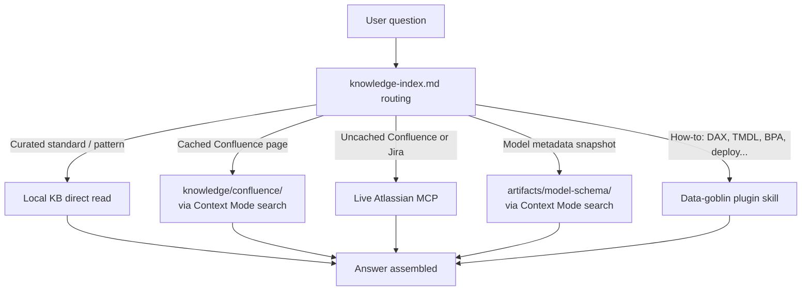
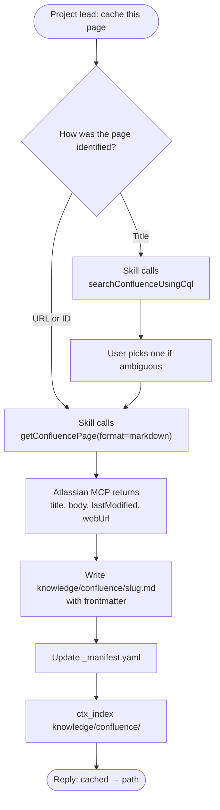

# Confluence Cache — Developer Guide

An overview of how this Power BI Assistant bridges three knowledge sources (your team's Confluence space, the local KB in this repo, and the [data-goblin plugin](https://github.com/data-goblin/power-bi-agentic-development)'s how-to skills), plus how it manages memory and information retrieval. This is how the assistant gets its information when you ask a question.

---

## 1. The Big Picture

Three sources, three purposes:

| Source | What it stores | When it's consulted |
|---|---|---|
| **Local KB** (`knowledge/`) | Curated team standards, per-model gotchas/performance findings, validated DAX patterns, **cached Confluence pages** | First stop — fast, offline, no network |
| **Live MCPs** (Atlassian, Power BI) | Nothing — fetched on demand | Confluence/Jira pages NOT in the cache; live model queries |
| **Data-goblin plugin** (`semantic-models:*`, `tabular-editor:*`, `pbip:*`, `reports:*`, `fabric-cli:*`) | How-to skills (procedural docs) | "How do I optimize this DAX / edit TMDL / write a BPA rule / deploy via CLI?" |

In one sentence: **the local KB is your behavioral and project-specific knowledge, the live MCP is your live network access to Atlassian and Power BI, and the plugin is your toolkit of HOW to do things.**

---

## 2. Routing Diagram

When you ask a question, Claude consults the routing manifest at `knowledge/knowledge-index.md` and routes by question type.

---

## 3. The Confluence Lane

When the project lead adds or refreshes a page in the cache, the `confluence-cache` skill orchestrates the full lifecycle:

Developers don't run this workflow themselves — they pull cached pages when they sync the repo. For ad-hoc questions about pages **not** in the cache, Claude routes directly to `getConfluencePage` without invoking the skill, keeping the cache focused on stable, high-traffic standards.

---

## 4. What's Stored Locally vs. On Demand

Most of what the assistant needs lives in this repo. Developers pull the latest changes and Claude has everything it needs locally; only true long-tail lookups (uncached Confluence, Jira) hit the network.

| Type | In the repo? | Where | How it gets updated |
|---|---|---|---|
| Curated team standards | Yes | `knowledge/pbi-modeling-standards.md` | Project lead edits and commits |
| Per-model findings (gotchas, performance, design decisions) | Yes | `knowledge/<model>-*.md` | Session learning loop, then committed |
| Validated DAX patterns | Yes | `knowledge/pbi-dax-patterns.md` | Session learning loop, then committed |
| Cached Confluence pages | Yes | `knowledge/confluence/<slug>.md` | Project lead runs `confluence-cache` skill and commits; devs sync the repo |
| Confluence cache manifest | Yes | `knowledge/confluence/_manifest.yaml` | Updated and committed alongside cached pages |
| `.bim` parsed snapshots *(live TE3 CLI access to TOM pending)* | Yes | `artifacts/model-schema/*.md` | Project lead runs `bim-parsing` skill and commits |
| Confluence pages NOT in the cache | No | — | Fetched live via the Atlassian MCP at runtime |
| Jira tickets | No | — | Fetched live via the Atlassian MCP at runtime |
| Data-goblin plugin how-to docs | No (per-user install) | `~/.claude/plugins/cache/...` | Installed and updated by each developer |

Developers using this repo don't write to `knowledge/` or `artifacts/` directly — the session learning loop surfaces new findings during interactive work, which the project lead reviews before committing.

---

## 5. Worked Example

> *"Why is this measure slow? It uses USERELATIONSHIP across the bridge."*

| Step | Source | Skill / file |
|---|---|---|
| Validated patterns for USERELATIONSHIP | Local KB | `knowledge/pbi-dax-patterns.md` |
| Prior bridge-scan findings on this model | Local KB | `knowledge/{model}-dax-performance.md` |
| Team standard for bridge traversal | Cached Confluence | `knowledge/confluence/<cached-standard>.md` |
| Actual relationship topology | `.bim` snapshot *(live TE3 CLI pending)* | `artifacts/model-schema/model-schema-<model>.md` |
| Optimization workflow (HOW to fix) | Plugin skill | `semantic-models:dax` |
| Standard not yet cached? Fall back live | Live MCP | Atlassian `getConfluencePage` |

Claude composes the answer from all of these — not just one.

---

## 6. Skill Map

Each skill owns a clearly-bounded slice of the workflow:

| Skill | Owns | Where |
|---|---|---|
| `confluence-cache` | Confluence cache lifecycle (grab / refresh / list / find-stale / remove) | `.claude/skills/confluence-cache/` |
| `powerbi-context-mode` | Retrieval routing for large local artifacts (`ctx_index` / `ctx_search`) | `.claude/skills/powerbi-context-mode/` |
| `bim-parsing` | Generating model-schema markdown from `.bim` files *(live TE3 CLI access to TOM pending)* | `.claude/skills/bim-parsing/` |
| `regression-testing` | Pre/post snapshots for refactor validation | `.claude/skills/regression-testing/` |
| `measure-benchmarking` | Profiling measure performance across contexts | `.claude/skills/measure-benchmarking/` |
| `refactor-strategy` | Topology refactor orchestration | `.claude/skills/refactor-strategy/` |
| `semantic-models:dax` | DAX optimization | data-goblin plugin |
| `semantic-models:*` (lineage / refresh / power-query / naming / review) | Domain-specific Power BI workflows | data-goblin plugin |
| `tabular-editor:*` (te2-cli / c-sharp-scripting / bpa-rules / suggest-rule / te-docs) | TE CLI, C# / TOM scripting, BPA authoring | data-goblin plugin |
| `pbip:tmdl`, `pbip:pbip`, `pbip:pbir-format` | TMDL editing, PBIP project structure, PBIR JSON | data-goblin plugin |
| `reports:*` (pbir-cli, modifying-theme-json, deneb-visuals, pbi-report-design, etc.) | Report-side work — visuals, themes, layout | data-goblin plugin |
| `fabric-cli:fabric-cli` | Workspace ops, capacity, deployment | data-goblin plugin |
| `pbi-desktop:connect-pbid` | Live TOM via PBI Desktop | data-goblin plugin |

The data-goblin plugin's skills are how-to references — they tell Claude **how** to fix DAX, edit TMDL, etc. The local KB and Confluence cache tell Claude **what** your team's standards and constraints are. Both layers are needed for a model-specific recommendation.

---

## 7. Why This Design

- **Local cache** = fast `ctx_search`, offline-able, participates in retrieval alongside the rest of the KB.
- **Live MCP** = always fresh, covers the long tail of pages we don't want to over-curate.
- **Data-goblin plugin** = unchanged — orthogonal to this project's KB. Plugin skills tell Claude *how* to fix DAX, not *what* the team's policy is.
- **Single skill (`confluence-cache`)** owns the lifecycle so the workflow is discoverable and the steps (resolve → fetch → write → manifest → re-index) can't be skipped.
- **One auth surface** (OAuth via the official Atlassian MCP) — no API tokens to rotate, no `.env` to manage.
