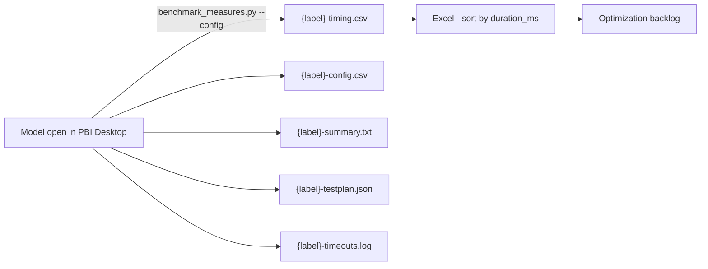

# Measure Benchmarking — Developer Onboarding Guide

> **Audience:** Developers new to Power BI performance work — no prior Python, Tabular Editor, or DAX optimization experience assumed.
>
> **Goal:** By the end of this guide, you can profile a set of measures end-to-end (select → configure → run → interpret) on any semantic model in the project, then prioritize the slowest for optimization.

---

## How to Read This Guide

The guide is organized in three concentric layers. Stop at the layer that answers your question.

| Layer | Sections | Best for |
|-------|---------|----------|
| **Layer 1 — Quick Start** | 1 | "I just need to run the benchmark" |
| **Layer 2 — Mental Model + Workflow** | 2–5 | "I need to design a benchmark plan / pick the right measures and contexts" |
| **Layer 3 — Architecture + Reference** | 6–10 | "Something failed and I need to debug, or I want to understand how this works under the hood" |


---

## 1. Quick Start

You're being asked to identify the slowest measures in a model for optimization prioritization — or to compare how a measure performs across different filter contexts. The benchmark answers one question: **"Which measures should I optimize first, and by how much?"** It captures **timing only** — no value validation, no before/after comparison.

It runs in Python against a model open in **Power BI Desktop** — no Tabular Editor required.

> **When NOT to use this:** If you're verifying a specific change didn't break results, use the regression-testing guide instead. Regression captures both values and timing; benchmarking captures timing only.

### The 4-step workflow

1. **Select measures** — Describe the measures you want to profile in plain English. Claude reads the model, proposes a list grouped by domain, and applies your exclusions ("skip time intelligence", "drop budget measures"). You confirm.
2. **Configure dimensions and filters** — With Claude, pick single-slice dimensions (e.g., by Market, by Month), an optional cross-product context (combined filters mimicking a matrix visual), global filters (TREATAS applied to every query), and an optional TOPN row cap.
3. **Run** — Claude writes `output/{label}.config.json`; you run `python scripts/benchmark_measures.py --config …`. The engine smoke-tests each measure, runs the full test matrix under timeouts and a memory watchdog, and writes a CSV.
4. **Interpret** — Sort `{label}-timing.csv` by `duration_ms` descending — the top of the list is your optimization backlog.

### Files involved

| File | What it is | Where it lives | You edit it? |
|------|-----------|----------------|--------------|
| `output/{label}.config.json` | Your session-specific benchmark config (pure data) | `output/` | Claude authors it; you review |
| `{label}-timing.csv` | Per-test-case timing (the primary deliverable) | `output/benchmark/` (override via `OUTPUT_DIR`) | No — auto-generated |
| `{label}-config.csv` | Filter context reference for manual validation | same folder | No — auto-generated |
| `{label}-summary.txt` | Top 10 Slowest + skipped + timed-out (also printed to stdout) | same folder | No — auto-generated |
| `{label}-testplan.json` | Pre-flight manifest of planned test cases | same folder | No — auto-generated |
| `{label}-errors.log` / `{label}-timeouts.log` | Failure detail with full DAX (only if any) | same folder | No — auto-generated |

### Where to next

- **First time?** → §2 (mental model) → §8 (worked example)
- **Need the workflow detail?** → §5
- **How do I run it / what can I override?** → §6
- **Something failed?** → §9
- **Don't know what a term means?** → §10

---

## 2. What Is Measure Benchmarking Here?

### Why benchmark the semantic model layer?

Power BI report performance has two halves: visual rendering (browser-side) and query execution (semantic-model-side). The slow half is almost always query execution — a measure that takes 8 seconds to evaluate will make every visual that uses it sluggish. Benchmarking the **semantic model layer** via DAX queries gives you per-measure timing data that maps directly to optimization work.

Manual DAX Studio profiling tests one measure at a time. Running 25–50 measures across multiple filter contexts manually would take hours and produce inconsistent timing (different cache states, different machine loads). The benchmark automates this — pre-flight smoke test, controlled timing per query, CSV output you can sort.

Capturing measure performance at the *report* layer is another non-starter: it introduces noise from the number of visual containers on the page (regardless of whether they query data — even a text box adds overhead). Simply looking at how long a report page or visual takes to load is NOT sufficient for accurate benchmarking and optimization prioritization. In fact, Microsoft recommends intentionally limiting the number of visuals on a page (see [Microsoft's Power BI optimization guidance](https://learn.microsoft.com/en-us/power-bi/guidance/power-bi-optimization#power-bi-reports)).

### The "find the slowest" pattern

You define the **measure list** (which measures to profile) and the **context matrix** (which filter contexts to evaluate them in). The engine runs every (measure × context) combination, writes timing to CSV, and the slowest entries are your optimization candidates. There's no "before/after" — just a single snapshot of current performance.

### Single run per test case — why no warm/cold averaging?

The benchmark cannot clear the Analysis Services engine cache between queries. Multiple runs would measure warm-cache performance after the first query, skewing results. A single pass gives the most honest mixed-cache timing — representative of typical report usage where some measures hit the cache and others don't. Running each test case once also keeps benchmark runtime manageable for sweeps over 25+ measures.

---

## 3. System Architecture

### Data flow



### Stable engine + JSON config pattern

The benchmark engine is the `scripts/pbi_capture/` package (shared with regression capture), fronted by `scripts/benchmark_measures.py`. It's tested, stable code — **never edited per session**. Each session, **Claude** writes a JSON config (`"workflow": "benchmark"`) with these fields, from your conversation:

1. `measures` — the list of measure names to profile (**bare** — no brackets)
2. `single_slice_dimensions` — label → DAX column map for one-dimension-at-a-time tests
3. `cross_product_columns` — list of DAX columns for the combined cross-product context (matrix-visual simulation)
4. `cross_product_value_filters` — column → values map for TREATAS slicer simulation
5. `global_filters` — column → values map applied as TREATAS to every query
6. `max_rows_per_context` — TOPN cap, or `0` for no cap

The engine builds the DAX from this data — including TREATAS construction to replicate the queries Power BI visuals generate. Its helpers (smoke test, memory watchdog, ADOMD execution, CSV writer, summary report) are fixed; Claude **only fills in data**.

### What's reusable vs what's per-model

- **Per-model:** measure list, dimensions, value filters, global filters — all written by Claude into `output/{label}.config.json` from your description, plus `{label}-config.csv` after the run for audit.
- **Model-agnostic:** the entire `scripts/pbi_capture/` engine — DAX construction, smoke test loop, watchdog, timeout enforcement, CSV format. One engine covers every model.

### Memory & timeout safeguards

The engine ships with a layered safety stack — each layer catches a different failure mode. Don't disable these on first run; they're what keeps a runaway query from locking up your dev box.

- **Pre-flight smoke test** — before the main loop, a grand-total `EVALUATE ROW("r", [Measure])` runs for every unique measure with a tight timeout. Any measure that fails (syntax error, broken dependency, smoke timeout) lands on a skip list and is recorded as `skipped` in every test case for that measure. Tune via `smoke_test_timeout_ms` (default 10 s).
- **Per-query timeout** — `query_timeout_ms` (default 60 s) cancels any individual query that runs too long; the test is recorded as `timeout` and the run continues.
- **Memory watchdog with debounce** — checks RAM during query execution every 500 ms; cancels the query after **3 consecutive critical readings** (≈1.5 s sustained pressure) above `memory_threshold_pct` (default 80 % of *real* total RAM). Between tests, a single critical reading aborts the run with status `aborted_memory`.
- **Smoke-skip toggle** — `skip_on_smoke_failure` (default `true`) skips smoke-failed measures; `false` attempts every measure regardless and relies on the wall-clock + memory watchdogs at runtime.

Tune these based on your machine and concurrent local workload. If a run aborts on memory or you see widespread timeouts, see [§9 Triage](#9-triage-reading-the-results) for the recovery sequence.

### False-negatives safeguard

The timing CSV captures both `row_count` and `distinct_values` per query. This is *not* result validation — values aren't checked against a baseline — but it's a quick sanity test on whether the measure actually evaluated under the test's filter context.

If `distinct_values = 1` while `row_count > 1`, the measure returned the same value for every grouping. That usually means the measure is degenerate under that context — missing relationship path, blocked filter propagation, hard-coded constant — and the engine short-circuited to a single value. **A fast `duration_ms` on a degenerate measure is not an optimized query.** Open the DAX in DAX Studio before crossing it off the optimization list.

---

## 4. The Toolkit

| Tool | Path | Role |
|---|---|---|
| **Claude (chat)** | n/a | Reads the model schema, proposes a measure list grouped by domain, applies plain-English exclusions, suggests dimensions and filters, writes `output/{label}.config.json` |
| **Benchmark runner + engine** | `scripts/benchmark_measures.py` + `scripts/pbi_capture/` | Builds DAX, runs it against the connected model with timeouts + watchdog, streams timing to CSV |
| **Excel (or any CSV viewer)** | n/a | Sort `{label}-timing.csv` by `duration_ms` descending — that's your optimization priority list |

### How they fit together

The flow is mostly conversational — you describe what you want to profile, Claude proposes, you confirm, Claude writes the config. The mechanical part is one command (`python scripts/benchmark_measures.py --config …`). CSV analysis is whatever's familiar — Excel, the pandas REPL, DAX Studio's CSV import. There's no purpose-built comparator the way regression testing has `compare-snapshots.py`, because there's nothing to diff — just timing to sort.

---

## 5. The 4-Phase Workflow

Phases 1–3 are **conversational with Claude** — you describe what you want to benchmark in plain English, Claude proposes the measure list, dimensions, and filters, and you confirm before anything runs. Phase 4 is mechanical: run the command, sort the CSV.

### Prerequisite — Give Claude model knowledge

Before Phase 1 can produce a useful measure list, Claude needs to **know your model** — its tables, columns, measures, relationships. There are three routes, in priority order:

| Route | When to use it | How Claude reads it |
|---|---|---|
| **Live TOM export** (TE-free) | Model open in PBI Desktop | `python scripts/export_schema.py` serializes the live model to the same schema markdown |
| **Parsed `.bim` snapshot** | You have a `.bim` on hand | `python scripts/bim_to_kb_markdown.py` → markdown in `artifacts/model-schema/`, retrieved via `powerbi-context-mode` so even large models stay out of the context window |
| **MCP server** (`powerbi-modeling-mcp`) | If you have it running | Live measure enumeration via `measure_operations` |

For the `.bim` route — a **one-time setup per model**, re-run only when the schema changes meaningfully:

```bash
python scripts/bim_to_kb_markdown.py "C:\models\{model}.bim" --output artifacts/model-schema/model-schema-{model}.md
```

After parsing, tell Claude *"index `artifacts/model-schema/model-schema-{model}.md`"* and you're ready for Phase 1.

### The four phases

| Phase | What you do | What gets produced |
|---|---|---|
| **1 — Select Measures** | Describe the measures to profile ("all [Domain A] cost measures, skip budget and time intelligence"). Claude proposes a list grouped by domain, applies exclusions, presents for confirmation. | Confirmed measure list |
| **2 — Configure Dimensions and Filters** | With Claude: pick single-slice dimensions, an optional cross-product context (with TREATAS value filters), global filters, TOPN cap. | Confirmed test matrix |
| **3 — Author the Config** | Claude writes `output/{label}.config.json` (`"workflow": "benchmark"`) and reads it back for confirmation. | `output/{label}.config.json` |
| **4 — Run and Interpret** | `python scripts/benchmark_measures.py --config output/{label}.config.json`, then sort `{label}-timing.csv` by `duration_ms`. | Optimization priority list |


### Decision points reference

**Phase 1 — Measure selection criteria**

The user describes measures using one or more approaches:
- **Domain description (semantic search)** — "all measures for [Domain A], [Domain B] costs and counts, and [Domain C] counts, excluding all budget measures and all time intelligence variations"
- **Explicit list** — paste measure names directly; Claude validates against the model
- **Hybrid** — domain description plus specific additions or removals

Common exclusion categories to clarify with Claude:
- Time intelligence variants (e.g., "(ly)", "(ytd)", "(mtd)", "YoY", "MoM", "vs PY")
- Budget / planning measures
- Internal helper measures (e.g., `_`-prefixed, or another model-specific convention)

**Phase 2 — Single-slice vs cross-product**

- **Single-slice dimensions** — each generates a separate query per measure with `SUMMARIZECOLUMNS('Table'[Column], "Result", [Measure])`. One row per distinct value.
- **Cross-product context** — one combined `SUMMARIZECOLUMNS` with multiple grouping columns, optionally constrained by TREATAS filter arguments. Mimics a matrix visual with multiple axes and slicers — the most expensive query shape and often where performance issues hide.
- **Global filters** — applied as TREATAS to every query, mimicking report-level filters (e.g. `'Date'[Year] → ["2025"]`).
- **TOPN cap** — `max_rows_per_context`. Default 0 = no cap. Use 50–100 only if high-cardinality dimensions cause timeouts; otherwise keep 0 to measure full query cost. (Unlike regression capture, benchmark *allows* a cap — timing tolerates truncation.)

If the cross-product row count is very high (>5,000 distinct combinations), narrow it with TREATAS value filters or use TOPN — otherwise you'll hit timeouts on every measure regardless of DAX quality.

---

## 6. Running It

The benchmark runs from any Python terminal against a model open in Power BI Desktop.

```bash
# (optional) sanity pass — first 8 tests only
python scripts/benchmark_measures.py --config output/{label}.config.json --diagnostic

# full sweep
python scripts/benchmark_measures.py --config output/{label}.config.json
```

The engine auto-discovers the local `msmdsrv` instance behind Power BI Desktop; disambiguate with `--port` / `--connection-string` if several models are open. Outputs land in `output/benchmark/`. Exit code `0` = run completed (per-test errors/timeouts are data); `2` = fatal setup error.

### CLI flags & environment variables

Precedence: **CLI flag > env var > config file > default**.

| Setting | CLI flag | Env var | Default | Purpose |
|---|---|---|---|---|
| Benchmark label | `--label` | `BENCHMARK_LABEL` | `run` | Output filename label |
| Diagnostic mode | `--diagnostic` | `DIAGNOSTIC_MODE` | `false` | Run only the first 8 tests |
| Output dir | — | `OUTPUT_DIR` | `output/benchmark` | Where the CSVs, summary, and logs land (shared with regression — you can point both at one folder) |
| msmdsrv port | `--port` | — | auto | Target a specific instance |
| Connection string | `--connection-string` | `CONNECTION_STRING` | auto | Full MSOLAP string for XMLA endpoints |
| Query timeout (ms) | — | `QUERY_TIMEOUT_MS` | `60000` | Per-query wall-clock cap |
| Smoke timeout (ms) | — | `SMOKE_TEST_TIMEOUT_MS` | `10000` | Per-measure pre-flight cap (set to 200–500 ms to exercise the smoke path) |
| Memory threshold (%) | — | `MEMORY_THRESHOLD_PCT` | `80` | Memory watchdog trip point (% of real RAM) |
| Skip on smoke fail | — | `SKIP_ON_SMOKE_FAILURE` | `true` | Skip smoke-failed measures vs. attempt every measure |

### Legacy: running inside Tabular Editor 3

The original implementation was a Tabular Editor 3 C# script, still shipped as `scripts/benchmark-measures.csx`. If you'd rather run it in the TE3 GUI (press **F5**), ask Claude to emit it — raw or pre-populated with your `measures`, `singleSliceDimensions`, `crossProductColumns`, `crossProductValueFilters`, `globalFilters`, and `maxRowsPerContext`. It writes the same timing CSV columns. Opt-in; the Python runner is the default and needs no Tabular Editor install.

---

## 7. How the Engine Works

You don't need to write any code — Claude authors the config and the engine does the rest. But understanding what it does helps when you triage failures or tune the safety stack. The engine lives in `scripts/pbi_capture/`.

### pythonnet + ADOMD.NET

The engine executes DAX through **ADOMD.NET**, Microsoft's .NET client library, loaded into Python via **pythonnet** (the `clr` module). The DLLs are provisioned once from NuGet into `libs/` by `provision_libs.py` — no Tabular Editor or .NET SDK required.

### Smoke-test gating

Before the main loop, a tight per-measure smoke test runs:

```dax
EVALUATE ROW("r", [Measure Name])
```

No filters, no grouping — just verifies the measure can return *something* without hanging or throwing. Failures go on a skip list; in the main loop, every test case for a skipped measure writes `status:"skipped"` with `duration_ms = 0`, plus one `Type: smoketest_*` entry per failed measure in `{label}-timeouts.log`. This catches machine-crashing runaway measures (whose grand-total alone allocates unbounded memory) at 10 s instead of letting them consume RAM for the full 60 s timeout.

### Cancellable execution — `cmd.Cancel()` → `conn.Dispose()`

`AdomdCommand.CommandTimeout` is unreliable for storage-engine-bound DAX, so the engine runs each query on a worker thread and polls every 500 ms. On a wall-clock timeout it calls `cmd.Cancel()` (interrupts SE-bound queries) and, as a backstop, drops the connection with `conn.Dispose()` — which interrupts *any* query, including pure formula-engine materializations. A fresh connection per query makes discarding a timed-out one free.

### Memory watchdog (real RAM, 3-poll debounce)

The watchdog reads **actual** total RAM via the Windows `GlobalMemoryStatusEx` API (no hard-coded denominator — so no per-machine scaling) and cancels a query after 3 consecutive critical readings (1.5 s sustained pressure) above `memory_threshold_pct`. This avoids aborting legitimate queries that briefly spike during normal `msmdsrv` evaluation. The between-test check has no debounce — a single critical reading aborts the run (`aborted_memory`).

### TREATAS for slicer simulation

Cross-product contexts (and the benchmark's global filters) use `TREATAS` to constrain columns to selected values:

```dax
SUMMARIZECOLUMNS(
    'Table A'[Column A],
    'Date'[Month],
    'Table C'[Column C],
    TREATAS({"Value 1"}, 'Table C'[Column C]),
    "Result", [Measure A]
)
```

`TREATAS` mirrors how Power BI passes slicer selections into visual queries — so the timing reflects the exact query shape your reports send.

### The config is the only thing you author

> The engine is fixed. Per session you (via Claude) write only `output/{label}.config.json`:
>
> ```json
> {
>   "workflow": "benchmark",
>   "measures": ["Total Sales", "Margin %"],
>   "single_slice_dimensions": { "by_month": "'Date'[Month]" },
>   "cross_product_columns": ["'Product'[Category]", "'Date'[Month]"],
>   "cross_product_value_filters": { "'Product'[Category]": ["Bikes"] },
>   "global_filters": { "'Date'[Year]": ["2025"] },
>   "max_rows_per_context": 0
> }
> ```
>
> Measure names are **bare** — no brackets. Full key reference: `docs/config-schema.md`.

---

## 8. First-Day Walkthrough

**Scenario:** Profile the [Domain A] and [Domain B] cost/count measures, current year only, sliced by Column A / Month / Column C, with a Value 1-only cross-product to mirror a known slow report page.

### Step 1: Plan with Claude (5 min)

```
You: I want to benchmark all the [Domain A] measures and [Domain B] cost
     measures. Skip budget and time intel. Slice by Column A, Month,
     and Column C. Cross-product those same three with Column C
     filtered to Value 1 only. Global filter to 2025.
```

Claude:
1. Confirms the model and reads the schema markdown
2. Proposes ~25 measures grouped by domain
3. Lists what it filtered out (e.g., 12 time-intelligence variants, 3 budget measures) so you can verify
4. You say "looks good" or "also drop X"

### Step 2: Configure (2 min)

Claude proposes:
- **Single-slice:** `by_col_a`, `by_month`, `by_col_c`
- **Cross-product:** Column A × Month × Column C, with TREATAS constraining Column C to `{"Value 1"}`
- **Global filter:** `'Date'[Year] → ["2025"]` (TREATAS)
- **TOPN:** 0 (no cap — you want full query cost)

Estimated test matrix: 25 measures × (1 grand_total + 3 single-slice + 1 cross-product) = 125 test cases. At ~2 s average per query, expect ~4 minutes plus smoke testing.

### Step 3: Author the config (1 min)

Claude writes `output/{model}-benchmark.config.json` and reads it back to you. You say "ship it."

### Step 4: Run (~5 min)

With Power BI Desktop open on the model:

```bash
python scripts/benchmark_measures.py --config output/{model}-benchmark.config.json
```

The engine:
1. Smoke-tests all 25 measures (~30 s)
2. Runs the 125 test cases sequentially, streaming timing to `{label}-timing.csv`
3. Writes `{label}-config.csv` (filter audit), `{label}-testplan.json` (manifest), `{label}-summary.txt`, and `{label}-timeouts.log` only if anything timed out or smoke-failed

The summary (stdout + `{label}-summary.txt`) shows Top 10 Slowest (ok-only), smoke-skipped measures, and Timed Out Queries.

### Step 5: Triage (~10 min)

Open `output/benchmark/{model}-benchmark-timing.csv` in Excel. Sort by `duration_ms` descending — the top 10 are your optimization candidates. Cross-reference with `{label}-timeouts.log` to distinguish wall-clock timeouts from memory cancels (read the `Type:` tag).

End-to-end: about 25 minutes total. The bulk of value is in steps 1–2 — getting the right measure list and context — because that determines whether your timing data maps to the queries your users actually run.

---

## 9. Triage: Reading the Results

### The timing CSV

`{label}-timing.csv` columns: `test_id, measure, context, status, row_count, duration_ms, distinct_values`

### Status values

| Status | Meaning |
|---|---|
| `ok` | Query completed successfully — `duration_ms` is real timing |
| `error` | Query errored (DAX reference error, missing relationship, TREATAS value typo, etc.) — see `{label}-errors.log` |
| `timeout` | Query cancelled mid-flight — wall-clock (`query_timeout_ms`) OR sustained memory pressure. Distinguish via `Type:` in `{label}-timeouts.log` |
| `skipped` | Measure failed pre-flight smoke test. One row per dimension permutation with `duration_ms = 0` |
| `aborted_memory` | The whole run was aborted by the between-test memory check before this test ran. `duration_ms = 0` |

### Reading the timeouts log

`{label}-timeouts.log` has one entry per timeout / smoke-failure with the full DAX. The `Type:` tag tells you which path tripped:

| Type | What happened |
|---|---|
| `query_timeout` | Wall-clock `query_timeout_ms` expired. `duration_ms ≈ query_timeout_ms`. Paste DAX into DAX Studio for triage |
| `memory_watchdog` | 3 consecutive critical RAM readings during query. `duration_ms ≈ 1.5–3 s` but `status = timeout` |
| `smoketest_timeout` | The pre-flight `EVALUATE ROW("r", [Measure])` exceeded `smoke_test_timeout_ms`. The measure is fundamentally broken or unbounded |
| `smoketest_error` | Pre-flight smoke test threw a DAX error. Likely a missing dependency or syntax issue |
| `query_error` | Main-loop query threw a DAX error. See the Reason line |

**Triage philosophy:** runaways are filtered (smoke test), then timeouts are data. A measure that times out under a rich cross-product context but passes single-slice IS the timing data you wanted — it tells you the measure is pathologically slow under that filter combination, exactly what report users would experience.

### Optimization prioritization framework

Sort by `duration_ms` descending. For each candidate, weigh these factors:

| Factor | Weight | Assessment |
|---|---|---|
| **Query time** | High | Absolute duration. Anything >5 s is a candidate; >10 s is urgent |
| **User visibility** | High | Is this measure on a frequently-used report page? |
| **Context sensitivity** | Medium | Slow only in cross-product? Likely a context transition or cardinality explosion issue |
| **Measure family size** | Medium | Is this a base measure that 10+ derived measures reference? Optimizing the base improves all dependents |
| **Optimization feasibility** | Medium | Known anti-patterns visible (nested SUMX, FILTER on table, redundant CALCULATE)? |
| **Row count ratio** | Low | High duration ÷ low row count = expensive per-row calculation |

### Recovering from a memory abort

If the run halts with status `aborted_memory` — the watchdog tripped because RAM stayed above threshold for too many checks — recover in this order. **Don't restart blindly**; you'll likely hit the same wall.

1. **Free up resources first.** Close browsers, IDEs, Docker, Teams/Slack, and anything else competing for RAM.
2. **Raise the threshold** if you have headroom. Bump `memory_threshold_pct` in the config (e.g. 80 → 90), or set `MEMORY_THRESHOLD_PCT` for the run.
3. **Identify the culprit.** Open `{label}-timeouts.log` and look for the test running just before the abort line — that's the query that drove RAM up.
4. **Quarantine and re-run.** Remove that measure (or that context) from the config. Claude can do this surgically if you paste the log entry. Re-run; the rest of the suite completes.
5. **Investigate the quarantined measure separately** in DAX Studio with Server Timings. Don't leave it quarantined indefinitely — it's a known-broken signal the benchmark itself can't tell you about.

### Testing the smoke pipeline

Setting `SMOKE_TEST_TIMEOUT_MS=200` (or 500) is a quick way to exercise the smoke-skip path end-to-end without waiting for a real broken measure. Most measures fail at that timeout and the run short-circuits with `skipped` rows in the CSV — useful for verifying the pipeline before touching the safety stack.

---

## 10. Glossary

### Power BI / DAX terms

| Term | Definition |
|---|---|
| **measure** | A DAX expression that returns a scalar value, evaluated in a filter context |
| **filter context** | The set of filters active when a measure is evaluated |
| **SUMMARIZECOLUMNS** | DAX function that groups a table by columns and projects measures — the query shape Power BI visuals use |
| **TREATAS** | DAX function that constrains a column to specific values inside SUMMARIZECOLUMNS — mirrors slicer behavior; the benchmark uses it for cross-product value filters *and* global filters |
| **KEEPFILTERS** | DAX modifier that preserves an existing filter when CALCULATE would otherwise replace it (used by the *regression* path's global filters) |
| **TOPN** | DAX function that returns the top N rows of a table — used here to cap query result size |
| **SE / FE** | Storage Engine / Formula Engine. SE is fast and parallel; FE is single-threaded and the usual bottleneck |
| **VertiPaq** | The columnar in-memory engine that stores Power BI tables |
| **ADOMD** | The .NET client library used to send DAX queries to Analysis Services; the engine loads it via pythonnet for cancellable execution |
| **TOM** | Tabular Object Model — .NET API for reading model metadata; used by `export_schema.py`, not by the benchmark itself |

### Benchmarking workflow terms

| Term | Definition |
|---|---|
| **smoke test** | Pre-flight `EVALUATE ROW("r", [Measure])` per measure with a tight timeout. Catches broken or runaway measures before the main loop |
| **single-slice** | A test case where the measure is grouped by exactly one dimension column |
| **cross-product** | A test case grouped by multiple columns at once, optionally constrained by TREATAS — mimics a matrix visual with multiple axes and slicers |
| **global filter** | A TREATAS filter applied to every test case — mimics a report-level filter |
| **memory watchdog** | The engine's RAM monitor that cancels queries (during) or aborts the run (between) above `memory_threshold_pct` |
| **debounce** | The 3-consecutive-poll requirement before the mid-query watchdog cancels — prevents false aborts on transient spikes |
| **config** | `output/{label}.config.json` — the pure-data benchmark definition Claude authors |
| **status** | The outcome column in the timing CSV: `ok`, `error`, `timeout`, `skipped`, `aborted_memory` |
| **Type tag** | The classification in `{label}-timeouts.log`: `query_timeout`, `memory_watchdog`, `smoketest_timeout`, `smoketest_error`, `query_error` |
