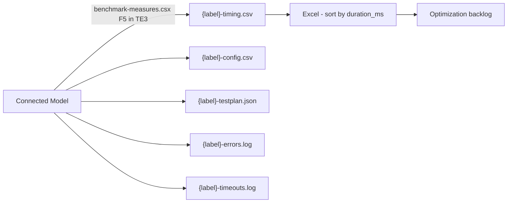
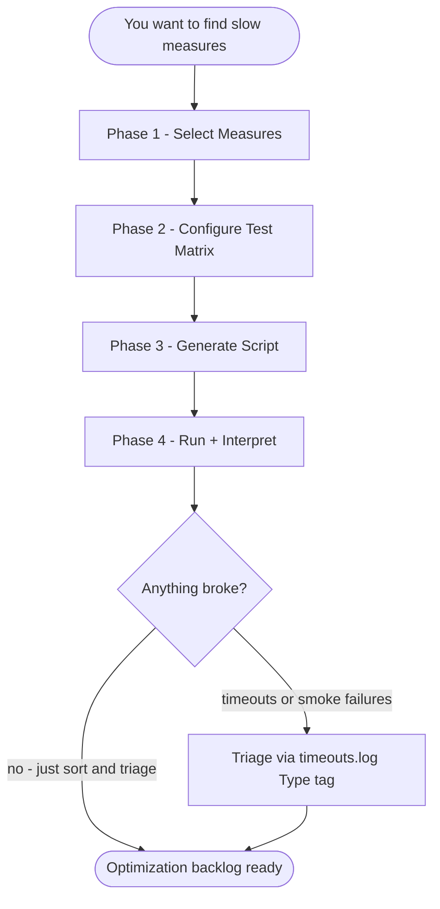

# Measure Benchmarking — Developer Onboarding Guide

> **Audience:** Developers new to Power BI performance work — no prior Tabular Editor scripting or DAX optimization experience assumed.
>
> **Goal:** By the end of this guide, you can profile a set of measures end-to-end (select → configure → generate → run → interpret) on any semantic model in the project, then prioritize the slowest for optimization.

---

## How to Read This Guide

The guide is organized in three concentric layers. Stop at the layer that answers your question.

| Layer | Sections | Best for |
|-------|---------|----------|
| **Layer 1 — Quick Start** | 1 | "I just need to run the benchmark" |
| **Layer 2 — Mental Model + Workflow** | 2–5 | "I need to design a benchmark plan / pick the right measures and contexts" |
| **Layer 3 — Architecture + Reference** | 6–10 | "Something failed and I need to debug, or I want to understand how this works under the hood" |


---

## 1. Quick Start

You're being asked to identify the slowest measures in a model for optimization prioritization — or to compare how a measure performs across different filter contexts. The benchmark answers one question: **"Which measures should I optimize first, and by how much?"** It captures **timing only** — no value validation, no before/after comparison.

> **When NOT to use this:** If you're verifying a specific change didn't break results, use the regression-testing guide instead. Regression captures both values and timing; benchmarking captures timing only.

### The 4-step workflow

1. **Select measures** — Describe the measures you want to profile in plain English. Claude reads the model, proposes a list grouped by domain, and applies your exclusions ("skip time intelligence", "drop budget measures"). You confirm before any script is generated.
2. **Configure dimensions and filters** — With Claude, pick single-slice dimensions (e.g., by Market, by Month), an optional cross-product context (combined filters mimicking a matrix visual), global filters (KEEPFILTERS applied to every query), and an optional TOPN row cap.
3. **Generate the script** — Claude copies the read-only `scripts/benchmark-measures.csx` template to `output/{label}.csx` and populates the 6 configuration sections. You confirm in chat, then open in TE3.
4. **Run and interpret** — Press <kbd>F5</kbd> in TE3. The script smoke-tests each measure, runs the full test matrix with timeouts and a memory watchdog, and writes a CSV. Sort by `duration_ms` descending — the top of the list is your optimization backlog.

### Files generated by Claude

| File | What it is | Where it lives | You edit it? |
|------|-----------|----------------|--------------|
| `output/{label}.csx` | Your session-specific copy of the benchmark script | `output/` | Optional — Claude can populate the 6 editable sections via chat, or you can hand-edit |
| `{label}-timing.csv` | Per-test-case timing (the primary deliverable) | Default: `Desktop\PBI-Benchmark\` (override via `OUTPUT_DIR` env var) | No — auto-generated |
| `{label}-config.csv` | Filter context reference for manual validation | Same folder | No — auto-generated |
| `{label}-testplan.json` | Pre-flight manifest of planned test cases | Same folder | No — auto-generated |
| `{label}-errors.log` | Full exception details (only if errors occur) | Same folder | No — auto-generated |
| `{label}-timeouts.log` | Timeout / smoke-failure entries with full DAX (only if any) | Same folder | No — auto-generated |

### Where to next

- **First time?** → §2 (mental model) → §8 (worked example)
- **Need the workflow detail?** → §5
- **What env vars can I override?** → §6
- **Something failed?** → §9
- **Don't know what a term means?** → §10

---

## 2. What Is Measure Benchmarking Here?

### Why benchmark the semantic model layer?

Power BI report performance has two halves: visual rendering (browser-side) and query execution (semantic-model-side). The slow half is almost always query execution — a measure that takes 8 seconds to evaluate will make every visual that uses it sluggish. Benchmarking the **semantic model layer** via DAX queries gives you per-measure timing data that maps directly to optimization work.

Manual DAX Studio profiling tests one measure at a time. Running 25–50 measures across multiple filter contexts manually would take hours and produce inconsistent timing (different cache states, different machine loads). The benchmark script automates this — pre-flight smoke test, controlled timing per query, CSV output you can sort.

In addition to the manual and time consuming aspects outlined above, capturing measure performance at the report layer is another non-starter, and introduces additional noise due to the number of visual containers on the page (regardless if they query data or not, such as a text box), which create additional overhead. Simply looking at how long it takes a report page or visual to load is NOT sufficient for accurate benchmarking and optimization prioritization. In fact, Microsoft recommends intentionally limiting the number of visuals on a page (see [Microsoft's Power BI optimization guidance](https://learn.microsoft.com/en-us/power-bi/guidance/power-bi-optimization#power-bi-reports)).

### The "find the slowest" pattern

You define the **measure list** (which measures to profile) and the **context matrix** (which filter contexts to evaluate them in). The script runs every (measure × context) combination, writes timing to CSV, and the slowest entries are your optimization candidates. There's no "before/after" — just a single snapshot of current performance.

### Single run per test case — why no warm/cold averaging?

TE3 scripting cannot clear the Analysis Services engine cache between queries. Multiple runs would measure warm-cache performance after the first query, skewing results. A single pass gives the most honest mixed-cache timing — representative of typical report usage where some measures hit the cache and others don't. Running each test case once also keeps benchmark runtime manageable for sweeps over 25+ measures.

---

## 3. System Architecture

### Data flow



### Template + Injection pattern

The benchmark script `scripts/benchmark-measures.csx` is a tested, read-only template — never edited directly. Each session, **Claude** copies it to `output/{label}.csx` and populates the **6 configuration sections**, based on your conversation:

1. `measures` — the list of measure names to profile
2. `singleSliceDimensions` — label → DAX column dictionary for one-dimension-at-a-time tests
3. `crossProductColumns` — list of DAX columns for the combined cross-product context (matrix visual simulation)
4. `crossProductValueFilters` — column → values dictionary for TREATAS slicer simulation
5. `globalFilters` — KEEPFILTERS expressions applied to every query
6. `maxRowsPerContext` — TOPN cap, or `0` for no cap

Note: the pattern uses TREATAS within the constructed DAX queries to replicate the query generated by Power BI visuals.

The script's helpers (smoke test, memory watchdog, ADOMD execution, TREATAS construction, CSV writer, Teams webhook, summary report) are copied verbatim from the template. Claude **never modifies these** — only fills in data.

### What's reusable vs what's per-model

- **Per-model:** measure list, dimensions, value filters, global filters — all populated by Claude from your description. Captured in `output/{label}.csx` for the session, plus `{label}-config.csv` after the run for audit.
- **Model-agnostic:** the entire `scripts/benchmark-measures.csx` template — DAX construction, smoke test loop, watchdog, timeout enforcement, CSV format. One template covers every model.

### Memory & timeout safeguards

The benchmark script ships with a layered safety stack — each layer catches a different failure mode. Don't disable these on first run; they're what keeps a runaway query from locking up your dev box.

- **Pre-flight smoke test** — before the main loop starts, the script runs a grand-total `EVALUATE ROW("r", [Measure])` for every unique measure with a tight timeout. Any measure that fails (syntax error, broken dependency, smoke-test timeout) lands on a skip list and is recorded as `skipped` in every test case for that measure during the main run. Tune via `SMOKE_TEST_TIMEOUT_MS` (default 10s).
- **Per-query timeout** — `QUERY_TIMEOUT_MS` (default 60s) cancels any individual query that runs too long via `cmd.Cancel()` on a thread-pool task; the test is recorded as `timeout` and the run continues with the next test.
- **Memory watchdog with debounce** — checks RAM during query execution every 500 ms; cancels the query after **3 consecutive critical readings** (≈1.5 s sustained pressure) above `MEMORY_THRESHOLD_PCT` (default 80%). Between tests, a single critical reading aborts the run with status `aborted_memory`. The 3-poll debounce avoids false aborts on transient spikes.
- **Direct ADOMD with cancellation** — `USE_DIRECT_ADOMD=true` (default) uses cancellable threaded execution; `false` falls back to `EvaluateDax()` which has no timeout and no cancellability.
- **Smoke-skip toggle** — `SKIP_ON_SMOKE_FAILURE=true` (default) skips smoke-failed measures in the main run; `false` attempts every measure regardless and relies on wall-clock + memory watchdogs for runtime safety (accepts long timeouts in exchange for not pre-filtering).

Tune these based on your machine and concurrent local workload.

If a run aborts on memory or you see widespread timeouts, see [§9 Triage](#9-triage-reading-the-results) for the recovery sequence.

### False Negatives Safeguard

The timing CSV captures both `row_count` and `distinct_values` per query. This is *not* result validation — values aren't checked against a baseline — but it's a quick sanity test on whether the measure actually evaluated under the test's filter context.

If `distinct_values = 1` while `row_count > 1`, the measure returned the same value for every grouping. That usually means the measure is degenerate under that context — missing relationship path, blocked filter propagation, hard-coded constant — and the engine short-circuited to a single value. **A fast `duration_ms` on a degenerate measure is not an optimized query.** Open the DAX in DAX Studio before crossing it off the optimization list.

---

## 4. The Three-Tool Toolkit

| Tool | Path | Role |
|---|---|---|
| **Claude (chat)** | n/a | Reads the model schema, proposes a measure list grouped by domain, applies plain-English exclusions, suggests dimensions and filters, populates the 6 editable sections of the benchmark script |
| **Benchmark script** | `scripts/benchmark-measures.csx` | Runs DAX queries against a connected model with timeouts + watchdog and streams timing data to CSV |
| **Excel (or any CSV viewer)** | n/a | Sort `{label}-timing.csv` by `duration_ms` descending — that's your optimization priority list |

### How they fit together

The flow is mostly conversational — you describe what you want to profile, Claude proposes, you confirm, Claude generates the populated `.csx`. The mechanical part is just opening the script in TE3 and pressing F5. CSV analysis is whatever's familiar — Excel, the Python pandas REPL, DAX Studio's CSV import — there's no purpose-built comparator the way regression testing has `compare-snapshots.py`.

---

## 5. The 4-Phase Workflow

Phases 1–3 are **conversational with Claude** — you describe what you want to benchmark in plain English, Claude proposes the measure list, dimensions, and filters, and you confirm before any script is generated. Phase 4 is mechanical: run the script in TE3, sort the CSV.

### Prerequisite — Give Claude model knowledge

Before Phase 1 can produce a useful measure list, Claude needs to **know your model** — its tables, columns, measures, relationships. There are three routes, in priority order:

| Route | When to use it | How Claude reads it |
|---|---|---|
| **Parsed `.bim` snapshot** (current default) | Today | Markdown representation in `artifacts/model-schema/`, retrieved via the `powerbi-context-mode` skill so even very large models stay out of the context window |
| **MCP server** (`powerbi-modeling-mcp.exe`) | If you have it running | Live measure enumeration via `measure_operations` |
| **Live TE CLI / TOM** | Future — once TE CLI is on every dev's machine | Direct query against the connected model |

For the `.bim` route, this is a **one-time setup per model** — re-run only when the schema changes meaningfully (new measures, renamed tables, relationship topology change):

```bash
# 1. Drop your model's .bim into a path you can reference, e.g. C:\models\{model}.bim
#
# 2. Ask Claude to parse the bim file to generate the markdown that Claude
#    retrieves from. Claude runs:
python scripts/bim_to_kb_markdown.py "C:\models\{model}.bim" --output artifacts/model-schema/{model-name}.md
```

After parsing, tell Claude something like *"index `artifacts/model-schema/{model}.md`"* and you're ready for Phase 1.

### The four phases

| Phase | What you do | What gets produced |
|---|---|---|
| **1 — Select Measures** | Describe the measures you want to profile ("all [Domain A] cost measures, skip budget and time intelligence"). Claude proposes a list grouped by domain, applies exclusions, presents for confirmation. | Confirmed measure list |
| **2 — Configure Dimensions and Filters** | With Claude: pick single-slice dimensions, an optional cross-product context (with TREATAS value filters for slicer simulation), global filters, TOPN cap. | Confirmed test matrix |
| **3 — Generate the Script** | Claude copies the read-only `benchmark-measures.csx` template to `output/{label}.csx`, populates the 6 configuration sections, reads back to you for confirmation. | Populated `output/{label}.csx` |
| **4 — Run and Interpret** | Open `output/{label}.csx` in TE3 (with PBI Desktop already running and TE3 connected), press <kbd>F5</kbd>. Sort `{label}-timing.csv` by `duration_ms`. | Optimization priority list |



### Decision points reference

**Phase 1 — Measure selection criteria**

The user describes measures using one or more approaches:
- **Domain description (semantic search)** — "all measures for [Domain A], [Domain B] costs and counts, and [Domain C] counts, excluding all budget measures and all time intelligence variations"
- **Explicit list** — paste measure names directly; Claude validates against the model
- **Hybrid** — domain description plus specific additions or removals

Common exclusion categories to clarify with Claude:
- Time intelligence variants (e.g., "(ly)", "(ytd)", "(mtd)", "YoY", "MoM", "vs PY")
- Budget / planning measures
- Internal helper measures (e.g., `_`-prefixed, or another model-specific convention)

**Phase 2 — Single-slice vs cross-product**

- **Single-slice dimensions** — each generates a separate query per measure with `SUMMARIZECOLUMNS('Table'[Column], "Result", [Measure])`. One row per distinct value.
- **Cross-product context** — one combined `SUMMARIZECOLUMNS` with multiple grouping columns, optionally constrained by TREATAS filter arguments. Mimics a matrix visual with multiple axes and slicers — the most expensive query shape and often where performance issues hide.
- **Global filters** — KEEPFILTERS applied to every query. Mimics report-level filters ("'Date'[Year] = 2025", "'Table A'[Column A] = Value 1").
- **TOPN cap** — `maxRowsPerContext`. Default 0 = no cap. Use 50–100 only if high-cardinality dimensions cause timeouts; otherwise keep 0 to measure full query cost.

If the cross-product row count is very high (>5,000 distinct combinations), narrow it with TREATAS value filters or use TOPN — otherwise you'll hit timeouts on every measure regardless of DAX quality.

---

## 6. Code Execution: GUI Workflow

Benchmarking is **GUI-only** — there is no headless CLI mode. You run the populated `output/{label}.csx` in TE3 by pressing <kbd>F5</kbd>. Configuration is via either editing the script's config block directly or setting environment variables before TE3 launches.

### Prereqs (the same three from §1)

1. **Power BI Desktop** open with the model loaded (starts the local Analysis Services instance).
2. **Tabular Editor 3** open and connected to that workspace (Workspace mode → pick the running workspace).
3. **Claude Desktop or Claude terminal** open in the project folder (so Claude can populate the script and read schemas).

The script auto-discovers the AS port by matching TE3's connected database GUID against PBI Desktop's running workspaces — you don't configure connection strings by hand. But that match fails if either prereq 1 or 2 isn't already in place.

### Environment variable contract

All variables are optional — defaults below match the in-script config block. Env vars override the in-script values, useful for one-off runs without touching the populated script.

| Variable | Default | Purpose |
|---|---|---|
| `OUTPUT_DIR` | `Desktop\PBI-Benchmark` | Where timing CSV, config CSV, testplan JSON, and logs are written. Auto-created if missing. Shared with regression testing — you can point both at the same folder. |
| `QUERY_TIMEOUT_MS` | `60000` | Per-query wall-clock cap. The script polls every 500 ms; on expiry calls `cmd.Cancel()` to interrupt the query. |
| `SMOKE_TEST_TIMEOUT_MS` | `10000` | Per-measure pre-flight smoke test cap. Tighter (e.g., 200–500 ms) to test the smoke pipeline; looser (e.g., 30000) if you have legitimately slow measures that pass smoke but are still worth benchmarking. |
| `MEMORY_THRESHOLD_PCT` | `80.0` | Memory watchdog trip point as % of RAM (16 GB hard-coded denominator — scale per your machine). |
| `USE_DIRECT_ADOMD` | `true` | When true, uses ADOMD with cancellable threaded execution. Set to false only as a compatibility escape hatch (loses timeout + cancellability). |
| `SKIP_ON_SMOKE_FAILURE` | `true` | When true, smoke-failed measures are skipped in the main run. Set to false to attempt every measure regardless. |
| `TEAMS_WEBHOOK_URL` | — | Post a summary to Teams on completion. See the regression testing guide for setup; the webhook works for both scripts. |

### Persisting env vars (PowerShell, User scope)

```powershell
[Environment]::SetEnvironmentVariable("OUTPUT_DIR", "C:\Users\you\Desktop\PBI-Benchmark", "User")
[Environment]::SetEnvironmentVariable("QUERY_TIMEOUT_MS", "120000", "User")
[Environment]::SetEnvironmentVariable("MEMORY_THRESHOLD_PCT", "40", "User")
```

Open a fresh shell (and restart TE3) for the changes to take effect.

---

## 7. C# Concepts You Will Encounter

You don't need to write C# or DAX — Claude does both. But understanding what the script is doing helps when you triage failures or want to tune the safety stack.

### Smoke test gating

Before the main loop, the script runs a tight per-measure smoke test:

```csharp
// For each unique measure in the test matrix:
EVALUATE ROW("r", [Measure Name])
```

No filters, no grouping. Just verifies the measure can return *something* without hanging or throwing. Failures are added to an in-memory `HashSet<string> skippedMeasures` and a `Dictionary<string, string> smokeResults` (measure → reason). In the main loop, every test case for a skipped measure writes `status:"skipped"` to the timing CSV with `duration_ms = 0`, plus one `Type: smoketest_*` entry per failed measure to `{label}-timeouts.log`.

**Why this matters:** earlier benchmark versions hit machine-crashing runaway measures whose grand-total alone allocated unbounded memory. The smoke test catches those at 10s instead of letting them consume RAM for the full 60s wall-clock timeout.

### ADOMD threaded execution with `cmd.Cancel()`

`AdomdCommand.CommandTimeout` is unreliable for SE-bound DAX queries — the storage engine can ignore it. The script instead runs each query on a thread-pool task and the script thread polls every 500 ms; on wall-clock expiry it calls `cmd.Cancel()` (the only mechanism that reliably interrupts a Tabular query). `CommandTimeout` is set as a backstop only.

### Memory watchdog with 3-poll debounce

The mid-query watchdog requires **3 consecutive critical readings** (3 × 500 ms = 1.5 s sustained pressure) before cancelling. This avoids aborting legitimate queries that briefly spike during normal `msmdsrv` evaluation — e.g., a SUMMARIZECOLUMNS that allocates working memory for a large group set. The between-test watchdog has no debounce — a single critical reading aborts the rest of the run with `status:"aborted_memory"`.

### TREATAS for slicer simulation

Cross-product contexts use `TREATAS` to constrain specific columns to user-selected values:

```dax
SUMMARIZECOLUMNS(
    'Table A'[Column A],
    'Date'[Month],
    'Table C'[Column C],
    TREATAS({"Value 1"}, 'Table C'[Column C]),
    "Result", [Measure A]
)
```

`TREATAS` mirrors how Power BI passes slicer selections into visual queries — measuring the timing here gives you per-measure performance for the exact query shape your reports send.

### The 6 sections you actually edit

(All populated by Claude based on your Phase 1–2 conversation; you confirm in chat.)

| Section | Type | Source |
|---|---|---|
| `measures` | `List<string>` | Phase 1 confirmed list |
| `singleSliceDimensions` | `Dictionary<string, string>` (label → DAX column) | Phase 2.1 |
| `crossProductColumns` | `List<string>` | Phase 2.2 |
| `crossProductValueFilters` | `Dictionary<string, List<string>>` (column → values) | Phase 2.2 |
| `globalFilters` | `List<string>` of KEEPFILTERS expressions | Phase 2.3 |
| `maxRowsPerContext` | `int` | Phase 2.4 |

Everything else in the file — helpers, smoke test loop, watchdog, ADOMD execution, CSV writer, summary report — is copied verbatim from `scripts/benchmark-measures.csx`. Claude **never regenerates these sections from scratch**.

---

## 8. First-Day Walkthrough

**Scenario:** Profile the [Domain A] and [Domain B] cost/count measures, current year only, sliced by Column A / Month / Column C, with a Value 1-only cross-product to mirror a known slow report page.

### Step 1: Plan with Claude (5 min)

```
You: I want to benchmark all the [Domain A] measures and [Domain B] cost
     measures. Skip budget and time intel. Slice by Column A, Month,
     and Column C. Cross-product those same three with Column C
     filtered to Value 1 only. Global filter to 2025.
```

Claude:
1. Confirms the model and reads the `.bim` schema markdown
2. Proposes a list of ~25 measures grouped by domain ([Domain A] Costs / [Domain A] Counts / [Domain B] Costs / [Domain B] Counts / [Domain C])
3. Lists what it filtered out (e.g., 12 time-intelligence variants, 3 budget measures) so you can verify
4. You say "looks good" or "also drop X"

### Step 2: Configure (2 min)

Claude proposes:
- **Single-slice:** `by_col_a`, `by_month`, `by_col_c`
- **Cross-product:** Column A × Month × Column C, with TREATAS constraining Column C to `{"Value 1"}`
- **Global filter:** `'Date'[Start of Year] = DATE(2025, 1, 1)`
- **TOPN:** 0 (no cap — you want full query cost)

Estimated test matrix: 25 measures × (1 grand_total + 3 single-slice + 1 cross-product) = 125 test cases. At ~2 s average per query, expect ~4 minutes of runtime plus smoke testing.

### Step 3: Generate the script (1 min)

Claude copies `scripts/benchmark-measures.csx` to `output/{model}-benchmark.csx`, populates the 6 sections, reads them back to you in chat for confirmation. You say "ship it."

### Step 4: Run (~5 min)

Open `output/{model}-benchmark.csx` in TE3 (with PBI Desktop already open and TE3 connected), press <kbd>F5</kbd>. The script:
1. Smoke-tests all 25 measures (~30s)
2. Runs the 125 test cases sequentially, streaming timing to `{label}-timing.csv`
3. Writes `{label}-config.csv` (filter context audit), `{label}-testplan.json` (manifest), and `{label}-timeouts.log` only if anything timed out or smoke-failed
4. Posts an optional Teams summary if `TEAMS_WEBHOOK_URL` is set

The TE3 `Info()` popup on completion shows Top 10 Slowest (ok-only), smoke-skipped measures, and Timed Out Queries.

### Step 5: Triage (~10 min)

Open `Desktop\PBI-Benchmark\{model}-benchmark-timing.csv` in Excel. Sort by `duration_ms` descending. The top 10 entries are your optimization candidates. Cross-reference with `{label}-timeouts.log` to distinguish wall-clock timeouts from memory cancels (read the `Type:` tag).

End-to-end: about 25 minutes total. The bulk of value is in steps 1–2 — getting the right measure list and context — because that determines whether your timing data maps to the queries your users actually run.

---

## 9. Triage: Reading the Results

### The timing CSV

`{label}-timing.csv` columns: `test_id, measure, context, status, row_count, duration_ms, distinct_values`

### Status values

| Status | Meaning |
|---|---|
| `ok` | Query completed successfully — `duration_ms` is real timing |
| `error` | Query errored (DAX reference error, missing relationship, TREATAS value typo, etc.) — see `{label}-errors.log` for full message |
| `timeout` | Query was cancelled mid-flight — either wall-clock (`QUERY_TIMEOUT_MS`) OR sustained memory pressure (memory watchdog). Distinguish via `Type:` tag in `{label}-timeouts.log` |
| `skipped` | Measure failed pre-flight smoke test. One row per dimension permutation with `duration_ms = 0` |
| `aborted_memory` | The whole run was aborted by the between-test memory check before this test ran. `duration_ms = 0` |

### Reading the timeouts log

`{label}-timeouts.log` has one entry per timeout / smoke-failure with the full DAX. The `Type:` tag tells you which path tripped:

| Type | What happened |
|---|---|
| `query_timeout` | Wall-clock `QUERY_TIMEOUT_MS` expired. `duration_ms ≈ QUERY_TIMEOUT_MS`. Paste DAX into DAX Studio for triage |
| `memory_watchdog` | 3 consecutive critical RAM readings during query. `duration_ms ≈ 1.5–3 s` (cancelled fast) but `status = timeout` |
| `smoketest_timeout` | The pre-flight `EVALUATE ROW("r", [Measure])` exceeded `SMOKE_TEST_TIMEOUT_MS`. The measure is fundamentally broken or unbounded |
| `smoketest_error` | Pre-flight smoke test threw a DAX error. Likely a missing dependency or syntax issue |
| `query_error` | Main-loop query threw a DAX error. Same as `error` status; see Reason |

**Triage philosophy:** runaways are filtered (smoke test), then timeouts are data. A measure that times out under a rich cross-product context but passes single-slice IS the timing data you wanted — it tells you the measure is pathologically slow under that filter combination, which is exactly what report users would experience.

### Optimization prioritization framework

Sort by `duration_ms` descending. For each candidate, weigh these factors:

| Factor | Weight | Assessment |
|---|---|---|
| **Query time** | High | Absolute duration. Anything >5s is a candidate; >10s is urgent |
| **User visibility** | High | Is this measure on a frequently-used report page? |
| **Context sensitivity** | Medium | Slow only in cross-product? Likely a context transition or cardinality explosion issue |
| **Measure family size** | Medium | Is this a base measure that 10+ derived measures reference? Optimizing the base improves all dependents |
| **Optimization feasibility** | Medium | Known anti-patterns visible (nested SUMX, FILTER on table, redundant CALCULATE)? |
| **Row count ratio** | Low | High duration ÷ low row count = expensive per-row calculation |

### Recovering from a memory abort

If the run halts with status `aborted_memory` — the watchdog tripped because RAM stayed above threshold for too many consecutive checks — recover in this order. **Don't restart blindly**; you'll likely hit the same wall.

1. **Free up resources first.** Close Power BI Desktop, browsers, IDEs, Docker, Teams/Slack, and anything else competing for RAM. (You'll re-open PBI Desktop and TE3 to re-run.)
2. **Raise the threshold** if you have headroom. Bump `MEMORY_THRESHOLD_PCT` in `output/{label}.csx` (e.g. 80 → 90).
3. **Identify the culprit.** Open `{label}-timeouts.log` and look for the test running just before the abort line — that's the query that drove RAM up.
4. **Quarantine and re-run.** Remove that measure (or that specific context) from `output/{label}.csx`. Claude can do this surgically if you paste the log entry. Re-run; the rest of the suite will complete.
5. **Investigate the quarantined measure separately** in DAX Studio with Server Timings. Don't leave it quarantined indefinitely — it's a known-broken signal that the benchmark itself can't tell you about.

### Testing the smoke pipeline

Setting `SMOKE_TEST_TIMEOUT_MS=200` (or 500) via env var is a quick way to exercise the smoke-skip path end-to-end without waiting for a real broken measure. Most measures will fail at that timeout and the run will short-circuit with `skipped` rows in the timing CSV. Useful for verifying the pipeline before committing changes to the safety stack.

---

## 10. Glossary

### Power BI / DAX terms

| Term | Definition |
|---|---|
| **measure** | A DAX expression that returns a scalar value, evaluated in a filter context |
| **filter context** | The set of filters active when a measure is evaluated |
| **SUMMARIZECOLUMNS** | DAX function that groups a table by columns and projects measures — the query shape Power BI visuals use |
| **TREATAS** | DAX function that constrains a column to specific values inside SUMMARIZECOLUMNS — mirrors slicer behavior |
| **KEEPFILTERS** | DAX function that preserves an existing filter when CALCULATE would otherwise replace it |
| **TOPN** | DAX function that returns the top N rows of a table by an expression — used to cap query result size |
| **SE / FE** | Storage Engine / Formula Engine. SE is fast and parallel; FE is single-threaded and the usual bottleneck |
| **VertiPaq** | The columnar in-memory engine that stores Power BI tables |
| **ADOMD** | The .NET client library used to send DAX queries to Analysis Services. The benchmark script uses it directly for cancellability |

### Benchmarking workflow terms

| Term | Definition |
|---|---|
| **smoke test** | Pre-flight `EVALUATE ROW("r", [Measure])` that runs once per measure with a tight timeout. Catches broken or runaway measures before the main loop |
| **single-slice** | A test case where the measure is grouped by exactly one dimension column |
| **cross-product** | A test case where the measure is grouped by multiple columns at once, optionally constrained by TREATAS — mimics a matrix visual with multiple axes and slicers |
| **global filter** | A KEEPFILTERS expression applied to every test case — mimics a report-level filter |
| **memory watchdog** | The script's RAM monitor that cancels queries (during) or aborts the run (between) when usage exceeds `MEMORY_THRESHOLD_PCT` |
| **debounce** | The 3-consecutive-poll requirement before the mid-query watchdog cancels — prevents false aborts on transient spikes |
| **TOM** | Tabular Object Model — the C# API the script uses to read model metadata (table list, measure expressions). The benchmark itself doesn't modify the model |
| **status** | The outcome column in the timing CSV: `ok`, `error`, `timeout`, `skipped`, `aborted_memory` |
| **Type tag** | The classification in `{label}-timeouts.log`: `query_timeout`, `memory_watchdog`, `smoketest_timeout`, `smoketest_error`, `query_error` |
