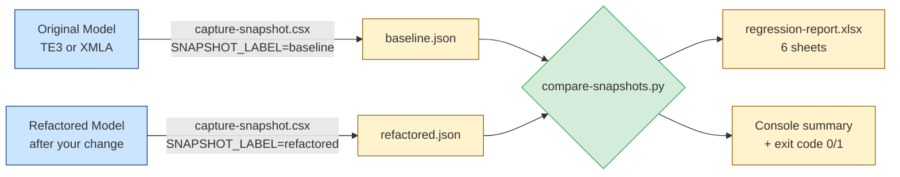
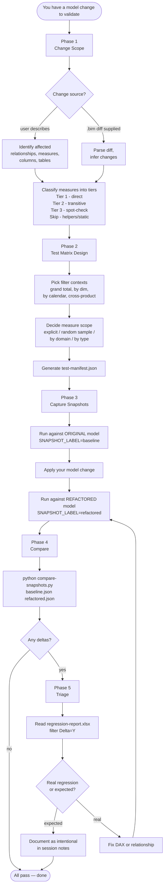

# Regression Testing — Developer Onboarding Guide

> **Audience:** Developers new to this Power BI workflow — no prior Tabular Editor scripting or C# experience assumed.
>
> **Goal:** By the end of this guide, you can run a regression test end-to-end (baseline → change → refactored → compare → report) on any semantic model in the project.

---

## How to Read This Guide

The guide is organized in three concentric layers. Stop at the layer that answers your question.

| Layer | Sections | Best for |
|-------|---------|----------|
| **Layer 1 — Quick Start** | 1 | "I just need to run the test" |
| **Layer 2 — Mental Model + Workflow** | 2–6 | "I need to design a test plan / pick the right options" |
| **Layer 3 — Architecture + Reference** | 7–12 | "Something failed and I need to debug, or I want to understand how this works under the hood" |

```mermaid
flowchart LR
    A[1 - Quick Start] --> B[2 - What and Why]
    B --> C[3 - Architecture]
    C --> D[4 - Three Tools]
    D --> E[5 - Five Phases]
    E --> F[6 - GUI vs CLI]
    F --> G[7 - C# Concepts]
    G --> H[8 - First-Day Walkthrough]
    H --> I[9 - Triage]
    I --> J[10 - Glossary]
    J --> K[11 - Future CI]
    K --> L[12 - Next]

    classDef quick fill:#d4edda,stroke:#28a745
    classDef workflow fill:#cce5ff,stroke:#004085
    classDef reference fill:#fff3cd,stroke:#856404
    class A quick
    class B,C,D,E,F workflow
    class G,H,I,J,K,L reference
```



---

## 1. Quick Start

You're being asked to verify that a model change (a new relationship, a rewritten DAX measure, a new calculated column, a relationship topology refactor) didn't silently break existing reports. The regression test answers one question: **"Do measures still return the same values they did before the change?"** It also tells you whether queries are now slower, faster, or hanging.

### The 5-step workflow

1. **Plan** — Decide which measures and which filter contexts to test. Claude builds this with you (Phases 1–2 of the workflow).
2. **Capture baseline** — Run the capture script against the **original** model. Produces `baseline.json`.
3. **Apply your change** — Edit the model (DAX rewrite, relationship change, calc column, etc.).
4. **Capture refactored** — Run the same script against the **modified** model. Produces `refactored.json`.
5. **Compare** — Run the Python comparator. Produces `regression-report.xlsx` — open in Excel, filter for `Delta = Y` to see what broke.

### Files you'll touch

| File | What it is | Where it lives | You edit it? |
|------|-----------|----------------|--------------|
| `output/{label}.csx` | Your session-specific copy of the capture script | `output/` | **Yes — but only 4 sections**, see §4 |
| `baseline.json`, `refactored.json` | Snapshots of model results | Default: `Desktop\PBI-Regression\` (override via env var) | No — auto-generated |
| `compare-snapshots.py` | Python comparator | `scripts/` | No — generic, ships as-is |
| `regression-report.xlsx` | Final Excel report (6 sheets) | Same folder as snapshots | No — auto-generated |

### Where to next

- **First time?** → §2 (mental model) → §8 (worked example)
- **Need the workflow detail?** → §5
- **Choosing GUI vs CLI?** → §6
- **Something failed?** → §9
- **Don't know what a term means?** → §10

---

## 2. What Is Regression Testing Here?

### Why test the semantic model, not the reports?

Power BI reports are visualizations on top of measures. A measure that quietly returns wrong values won't always be obvious in a visual — a bar chart will happily render incorrect bars, a card will display a wrong number. Multiple reports use the same measures, so testing the **semantic model layer** validates every report at once. Manual visual testing doesn't scale and misses edge cases.

### The "before vs after" pattern

You capture two snapshots:

- **Baseline** — what the model produces *today*, before your change. This is your ground truth.
- **Refactored** — what the model produces *after* your change.

The comparison is value-by-value. Same query, same filter context, same measure — different results means a regression candidate (or an intentional change you'll mark as expected).

> **Critical:** You must capture baseline **before** applying changes. Once the model is changed, the original baseline is gone forever.

### Model-agnostic toolkit, model-specific config

This project supports multiple semantic models — Maintenance & Construction (M&C), Occupancy, Leasing, Accounting, etc. Each has different tables, measures, and dimensions. But the regression toolchain is the same for all of them:

- **Stable across models:** the capture script's DAX construction logic, the comparator, the report format.
- **Per-model:** the test case list (which measures × which contexts) and the dimension column references (which `'Table'[Column]` paths are valid in this model).

When a new model is onboarded, you reuse the entire toolchain and only generate a new test case list and dimension map.

---

## 3. System Architecture

### Data flow



The same capture script runs twice — once against the original model, once against the modified model. The Python comparator then diffs the two JSON outputs.

### Template + Injection pattern

This is the central architectural pattern of the toolkit. Understanding it is critical:

- `scripts/capture-snapshot.csx` is a **read-only template**. It contains 900+ lines of generic, tested logic (DAX query construction, port discovery, timeouts, memory watchdog, JSON serialization, Teams webhook). **You never edit this file.**
- Per session, you copy it to `output/{label}.csx` and edit only **four small sections** of the copy:
  1. The PURPOSE comment (top of file) — what model and what change this validates
  2. `modelName` (line ~62) — written into the JSON header
  3. `testLines` block (line ~524) — the list of test cases for this session
  4. `groupByColumns` dictionary (line ~540) — DAX column references for this model's dimensions

Everything else is verbatim. This is what makes the toolkit model-agnostic: the engine doesn't know or care which model you're testing — it just executes the test cases you give it.

### What's reusable vs what's per-model

| Stable across all models (don't touch) | Per-model (regenerate when model changes) |
|----------------------------------------|-------------------------------------------|
| DAX query construction logic | `testLines` list (`measure × context` test cases) |
| Smoke test pre-flight | `groupByColumns` dictionary (DAX column refs) |
| Timeout + memory watchdog | `modelName` config |
| JSON output format | Optional `globalFilters` for this model |
| Comparison tolerance + verdict thresholds | Recommended `maxRowsPerContext` (depends on model size) |

---

## 4. The Three-Tool Toolkit

| Tool | Path | Role | You edit it? | Run from |
|------|------|------|--------------|----------|
| **Capture script** | `scripts/capture-snapshot.csx` | Runs DAX measures against a connected model and streams results to JSON | Read-only template — copy to `output/{label}.csx` and edit only 4 sections of the copy | Tabular Editor 3 GUI **or** TabularEditor.exe CLI |
| **Comparator** | `scripts/compare-snapshots.py` | Diffs two JSON snapshots; emits a 6-sheet Excel report and console summary | Never edit — fully generic | Any Python 3 environment (VS Code terminal, PowerShell, CI runner) |

### How they fit together

```mermaid
flowchart TD
    T[scripts/capture-snapshot.csx<br/>READ-ONLY template] -->|Claude copies to| O[output/{label}.csx<br/>session-specific copy]
    S[Model schema<br/>TE CLI or artifacts/model-schema/] -->|Claude generates testLines +<br/>groupByColumns| O
    O -->|run in TE3 or via CLI| J1[baseline.json]
    O -->|run again with new label| J2[refactored.json]
    J1 --> P[scripts/compare-snapshots.py]
    J2 --> P
    P --> X[regression-report.xlsx]

    classDef stable fill:#d4edda,stroke:#28a745
    classDef session fill:#fff3cd,stroke:#856404
    class T,P stable
    class O,J1,J2,X session
```

No pre-built helper scripts are needed. Each session, Claude reads the model schema (via TE CLI or `artifacts/model-schema/`), generates the `testLines` and `groupByColumns` blocks, copies the template to `output/{label}.csx`, and injects the blocks into the copy.

---

## 5. The 5-Phase Workflow



### Per-phase summary

| Phase | What you do | What you produce |
|-------|-------------|------------------|
| **1 — Change Scope** | Describe (or supply a `.bim` diff for) the change. Classify affected measures into Tier 1/2/3/Skip. | Confirmed change list + tier classification |
| **2 — Test Matrix Design** | Pick the dimensions and contexts to test against. Decide whether to test all measures or sample. | `test-manifest.json` (test cases + tiers + contexts) |
| **3 — Capture** | Run the capture script twice — once before changes (baseline), once after (refactored). | `baseline.json` + `refactored.json` (+ timing CSV + error/timeout logs if any) |
| **4 — Compare** | Run `compare-snapshots.py` on the two JSONs. | `regression-report.xlsx` + console summary + exit code |
| **5 — Triage** | Filter for `Delta = Y` in the Excel report. Decide what's a real regression vs. expected. | Either a green light, or fixes that send you back to Phase 3 |

### Decision points reference

These are the choices you'll face during planning. Defaults work for most cases; deviate when the situation calls for it.

| Decision | Default | When to override |
|----------|---------|------------------|
| **Single-dimension vs cross-product** | Single-dimension for most contexts | Add cross-product (Dim A × Dim B) for Tier 1 measures when the change affects how multiple dimensions filter a fact table or when reports use multi-slicer layouts |
| **Measure scope** | Test all Tier 1 + Tier 2 measures | Random sample (~20 measures stratified by domain) when full set is too large; domain or type filter when investigating a specific area |
| **`maxRowsPerContext` (TOPN)** | 0 (all rows) for final pre-deployment validation | 3–5 rows during iterative development for speed |
| **`globalFilters`** | Empty (test the full model) | Pin to a year/property when investigating a specific subset or for faster dev iteration |
| **Calc-group testing** | Test base measures only | Test with each calc item (YTD, MTD, PY) when the change touches a calculation group |
| **Cross-product cardinality cap** | Max 3 dimensions | Never combine high-cardinality dimensions (Vendor, Property) — they explode the test count |

> **Where Claude fits:** Phases 1 and 2 are conversational with Claude — see `.claude/skills/regression-testing/SKILL.md` for the full questioning protocol. Phases 3–5 are mechanical: the developer runs scripts and reads the report.

---

## 6. Code Execution: GUI vs CLI

There are two equally-supported ways to run the capture script. Both produce identical output.

### Side-by-side

| Step | GUI (Tabular Editor 3) | CLI (TabularEditor.exe) |
|------|------------------------|-------------------------|
| **1. Open model** | File → Open → your `.pbip` (or connect to XMLA endpoint) | Pass `model.bim` path as the first argument |
| **2. Set the label** | Open `output/{label}.csx` in TE3's script editor; edit `snapshotLabel` line directly | `set SNAPSHOT_LABEL=baseline` (or `export` on Linux/macOS) |
| **3. Capture baseline** | Tools menu → Run Script (or hit F5 in the script tab) | `TabularEditor.exe model.bim -S output/{label}.csx` |
| **4. Apply your model change** | Edit the model in TE3 (relationships, measures, etc.) and save | Apply changes via separate refactor `.csx`, deployment script, or PBIP edit |
| **5. Capture refactored** | Edit `snapshotLabel = "refactored"`, re-run script | `set SNAPSHOT_LABEL=refactored` then `TabularEditor.exe model.bim -S output/{label}.csx` again |
| **6. Compare** | `python compare-snapshots.py baseline.json refactored.json` (same in both) | Same |

### When to pick which

| Use the GUI when… | Use the CLI when… |
|-------------------|-------------------|
| Iterating interactively on the test plan (rerunning small subsets) | Automating runs (CI pipeline, scheduled batches) |
| Debugging a specific test (`diagnosticMode = true` shows DAX + result popups) | Running multiple models / labels in sequence without baby-sitting |
| Visually verifying the model is connected before running | Running on a build agent that doesn't have TE3 GUI |
| You haven't installed TabularEditor.exe (TE2) yet | You don't want to edit the `.csx` between baseline and refactored |

### Complete CLI session example (Windows PowerShell)

```bash
# One-time setup — point env at desired output folder (overrides Desktop default)
set OUTPUT_DIR=C:\Users\dkay\Desktop\PBI-Regression
set MODEL_NAME=Your Model Name

# Baseline capture against the original model
set SNAPSHOT_LABEL=baseline
TabularEditor.exe "C:\path\to\original-model.bim" -S "output\{model}-regression.csx"

# (Now apply your change — could be another csx, a deployment, a manual edit)

# Refactored capture against the modified model
set SNAPSHOT_LABEL=refactored
TabularEditor.exe "C:\path\to\refactored-model.bim" -S "output\{model}-regression.csx"

# Compare — produces regression-report.xlsx in the current folder
python scripts\compare-snapshots.py "%OUTPUT_DIR%\baseline.json" "%OUTPUT_DIR%\refactored.json"
```

### CLI environment variable contract

The capture script reads these env vars (all optional except where noted). When unset, the hardcoded defaults in the script apply.

| Env Var | Default | What it controls |
|---------|---------|------------------|
| `SNAPSHOT_LABEL` | `"refactor"` | Output filename label (`baseline` / `refactored`) |
| `MODEL_NAME` | placeholder | Written to JSON header for downstream reports |
| `DIAGNOSTIC_MODE` | `false` | When `true`, runs only first 8 tests with popups |
| `OUTPUT_DIR` | `Desktop\PBI-Regression` | Where snapshots, logs, CSVs land |
| `TEAMS_WEBHOOK_URL` | (empty) | Optional Power Automate webhook for completion notification |
| `QUERY_TIMEOUT_MS` | `60000` | Per-query wall-clock timeout |
| `SMOKE_TEST_TIMEOUT_MS` | `10000` | Per-measure pre-flight timeout |
| `MEMORY_THRESHOLD_PCT` | `80` | Memory watchdog trip threshold (% of RAM) |
| `USE_DIRECT_ADOMD` | `true` | Use cancellable ADOMD execution; `false` falls back to `EvaluateDax()` |
| `SKIP_ON_SMOKE_FAILURE` | `true` | Skip measures that fail pre-flight smoke test |
| `CONNECTION_STRING` | (auto-discovered) | Full MSOLAP connection string — set for XMLA endpoints (Fabric, Premium) |

The full env-var contract is documented at the top of `scripts/capture-snapshot.csx` (lines 29–47).

> **Migration note:** The current default workflow leans on the GUI because it's how the project started. As the team builds out CI, the CLI path becomes primary — see §11.

---

## 7. C# Concepts You Will Encounter

You don't need to *write* C#. You need to *read* enough of `capture-snapshot.csx` to know what's happening when something goes wrong. Here's the minimum vocabulary.

### TOM — the Tabular Object Model

`Model.Tables`, `Model.Database`, `Model.Database.Server.ConnectionString` — these are properties exposed by the **Tabular Object Model (TOM)**, the C# API that Tabular Editor uses to read and modify the connected semantic model. When the script writes `Model.Database.Name`, it's asking "what's the GUID of the currently-connected model?" The script uses this GUID to match the local Analysis Services port that's serving the model.

You won't change anything via TOM in regression testing — the script is **read-only** with respect to the model.

### `EvaluateDax()` vs ADOMD direct execution

`EvaluateDax()` is Tabular Editor's built-in helper — give it a DAX string, get back a DataTable. Easy to use, but **it can't be cancelled**. A query that hangs will freeze TE3 indefinitely.

To get cancellable execution, the script optionally uses **ADOMD.NET** directly (when `useDirectAdomd = true`, which is the default). ADOMD lets the script call `cmd.Cancel()` on the running command — the only mechanism that actually interrupts a stuck Storage Engine query. This is what makes `queryTimeoutMs` work.

If you ever see queries hang the script for minutes, check that `useDirectAdomd` is `true`.

### Environment variable overrides

You'll see this pattern repeated throughout the configuration block:

```csharp
var snapshotLabel = System.Environment.GetEnvironmentVariable("SNAPSHOT_LABEL")
    ?? "refactor";
```

The `??` is the C# null-coalescing operator. Translation: "if the `SNAPSHOT_LABEL` env var is set, use it; otherwise use `'refactor'` as the default." This is what makes the same `.csx` file work seamlessly in both GUI mode (no env vars, edit the literal) and CLI mode (set env vars, leave the literal alone).

### `SUMMARIZECOLUMNS` wrapping

For each test case, the script builds a DAX query like:

```dax
EVALUATE
TOPN(
    5,
    SUMMARIZECOLUMNS(
        'Calendar'[Start of Month],
        "Result", CALCULATE([Avg Open WO Age DK], KEEPFILTERS('Calendar'[Year] = 2025))
    )
)
```

That's the construction logic in `capture-snapshot.csx`. You don't write it — but you do supply the inputs:

- The measure name (`testLines`)
- The grouping column (`groupByColumns`)
- Optional `globalFilters` (`KEEPFILTERS`)
- Optional `maxRowsPerContext` (`TOPN`)

The script handles the rest, including grand-total queries (no grouping, single row) and cross-product queries (multiple group columns separated by `|`).

### Smoke-test gating

Before running the full test set, the script runs a quick **grand-total smoke test** for every unique measure:

```dax
EVALUATE ROW("r", [Measure Name])
```

If that fails (syntax error, broken dependency, timeout), the measure is added to a skip list and marked `"status": "skipped"` in every test case for that measure in the main run. This keeps a single broken measure from cascading timeouts across the entire suite.

If you see lots of `skipped` rows in the report, check `{label}-timeouts.log` for the smoke-test failures — the entries are tagged `Type: smoketest_*`.

### The four sections you actually edit

> **You read the rest of the script. You only edit these four sections of `output/{label}.csx`:**
>
> 1. **PURPOSE comment** (top, ~line 12) — describe the session
> 2. **`modelName`** (~line 62) — the model display name
> 3. **`testLines`** (~line 524) — the test case list, format: `"t0001|Measure Name|context_label"`
> 4. **`groupByColumns`** (~line 540) — context label → DAX column expression
>
> Claude generates these sections at runtime from the model schema — no pre-built helper scripts needed.

---

## 8. First-Day Walkthrough

Scenario: you're a new developer on day one. The lead engineer asks you to validate a relationship change — a new direct foreign key is being added between two tables, replacing an older bridge-table path.

### Step 1: Plan the test (5 min, with Claude)

Open Claude in this project and say:
> "I'm validating a refactor — adding a direct FK between [Table A] and [Table B] to replace the existing bridge path. Help me build a regression test."

Claude will trigger the `regression-testing` skill, walk you through Phase 1 (change scope, tier classification) and Phase 2 (test contexts, measure selection), and produce a `test-manifest.json` summary. Confirm the plan.

### Step 2: Generate the capture script (1 min)

Claude reads the model schema, selects the relevant measures and contexts, copies `scripts/capture-snapshot.csx` to `output/{model}-baseline.csx`, and injects the generated `testLines` and `groupByColumns` blocks. Confirm the measure list and contexts before proceeding.

### Step 3: Capture baseline (~5 min at TOPN=5)

**GUI path:**
1. Open the original `.pbip` in TE3
2. Open `output/{model}-baseline.csx` in TE3's script tab
3. Verify `snapshotLabel = "baseline"` and `diagnosticMode = false`
4. Hit F5
5. Wait for "Snapshot complete" — output lands at `Desktop\PBI-Regression\baseline.json`

**CLI path:**
```bash
set SNAPSHOT_LABEL=baseline
TabularEditor.exe "C:\path\to\original-model.bim" -S "output\{model}-baseline.csx"
```

### Step 4: Apply the change

Run the refactor script (or make the change manually in TE3, or deploy the modified `.bim`).

### Step 5: Capture refactored (~5 min)

**GUI path:** edit the script — `snapshotLabel = "refactored"` — and re-run.

**CLI path:**
```bash
set SNAPSHOT_LABEL=refactored
TabularEditor.exe "C:\path\to\modified-model.bim" -S "output\{model}-baseline.csx"
```

### Step 6: Compare (~30 sec)

```bash
python scripts\compare-snapshots.py ^
    "%OUTPUT_DIR%\baseline.json" ^
    "%OUTPUT_DIR%\refactored.json"
```

You'll get a console summary like:

```
VALUE COMPARISON
  Pass:        1942 / 1950
  Fail:           4 / 1950
  Row count:      0 / 1950
  Errors:         4 / 1950
  Delta = Y:      8 / 1950

TIMING COMPARISON
  Baseline:      142.3s
  Refactored:     98.5s
  Δ overall:    -30.8%
  Regressions:     3
  Improvements:   28

Report written: regression-report.xlsx
```

### Step 7: Triage

Open `regression-report.xlsx` in Excel:
- Go to the **All Tests** sheet, filter `Delta = Y`
- For each failing row, check the **Value Deltas** sheet for the specific row/column that differs
- BLANK → 0 changes are common when relationship paths change — investigate whether they're expected
- Newly timed-out tests appear in **Timeout Regressions**

If everything is expected (e.g., the BLANK → 0 changes match the refactor's intent), document it. Otherwise, fix the DAX or relationship and loop back to Step 5.

**End-to-end at TOPN=5: about 12–15 minutes total** for the M&C model. Full validation at TOPN=0 takes longer (depends on model size) and runs before deployment.

---

## 9. Triage: Reading the Report

### The 6 sheets of `regression-report.xlsx`

| Sheet | What it shows | When to look here |
|-------|---------------|-------------------|
| **All Tests** | Every test case from baseline + refactored, with `Delta Y/N` flag, baseline/refactored timing, % delta, timing verdict | Start here. Filter `Delta = Y` for failures, sort `Δ ms` desc for performance regressions |
| **Value Deltas** | Only `Delta = Y` rows, expanded to show the specific row key + column + baseline value + refactored value | Drill in to understand exactly what differed |
| **By Measure** | Aggregation by measure: total/avg timing, regression/improvement counts, value delta count | Identify which measures concentrate the failures |
| **By Context** | Same aggregation by context label (`grand_total`, `by_dim1`, etc.) | Identify which contexts (filter scenarios) are affected |
| **Top Movers** | Top 20 timing regressions + Top 20 timing improvements | Performance triage — what got slower or faster |
| **Timeout Regressions** | Tests that newly timed out in refactored (or were fixed — baseline timed out, refactored didn't) | Hangs and fixes — most critical class of regression |

### Status codes

When a test result has anything other than `status: "ok"`, check the logs:

| Status | Meaning | Where to investigate |
|--------|---------|----------------------|
| `ok` | Query succeeded (still might have value delta) | Compare values in **Value Deltas** sheet |
| `error` | Query threw an exception | `{label}-errors.log` — full DAX + exception |
| `timeout` | Query was cancelled (wall-clock or memory watchdog) | `{label}-timeouts.log` — `Type:` tag distinguishes `query_timeout` vs `memory_watchdog` |
| `skipped` | Measure failed pre-flight smoke test, never ran in main loop | `{label}-timeouts.log` — `Type: smoketest_timeout` or `smoketest_error` |
| `aborted_memory` | Run halted between tests due to sustained memory pressure | `{label}-timeouts.log` and watch the script's console output for the abort line |

### Common failure patterns

| Pattern | Likely cause |
|---------|--------------|
| **BLANK → 0 (or vice versa)** | New relationship path now produces a match where the old one didn't — could be intentional or a sign of unintended filter propagation |
| **Row count mismatch** | Filter propagation changed; the new path includes/excludes rows differently |
| **Cross-product fails, single-dim passes** | Combined filter interaction issue — usually a relationship direction or cardinality change |
| **Newly timed out** | Refactor broadened a scan (e.g., removed a CROSSFILTER, changed bidir to single dir, introduced ambiguous path) |
| **Numeric difference within tolerance** | Will not flag — the comparator uses `1e-4` tolerance to absorb float arithmetic noise |
| **Many `skipped` measures** | A common dependency (a base measure or relationship) broke the smoke test — fix that one thing and most of the skips will resolve |

### Exit codes (for CI integration)

- `0` — all tests passed (no value deltas, no new errors, no new timeouts)
- `1` — at least one of: value delta, row count mismatch, error in either snapshot, new timeout in refactored

---

## 10. Glossary

### Power BI / DAX terms

| Term | Definition | Why it matters here |
|------|-----------|---------------------|
| **SE** | Storage Engine — the columnar data engine that scans the compressed model | Most regression timeouts originate here; the watchdog cancels SE-bound queries |
| **FE** | Formula Engine — evaluates DAX expressions outside the columnar scan | Counterpart to SE; a DAX rewrite that pushes work from SE to FE often shows up as timing changes |
| **TOM** | Tabular Object Model — C# API for the semantic model | The capture script reads model metadata via TOM; you don't modify it through TOM here |
| **TMDL** | Tabular Model Definition Language — text-based serialization of a model (used by PBIP) | Not used directly by regression testing; relevant if you onboard a model via TMDL instead of `.bim` |
| **ADOMD** | Analysis Services OLE DB for Data Mining — the .NET client library for executing DAX | The cancellable execution path in the capture script uses ADOMD directly |
| **MSOLAP** | Microsoft OLAP provider — the connection string protocol for Analysis Services | The `CONNECTION_STRING` env var expects this format for XMLA endpoints |
| **XMLA** | XML for Analysis — the protocol used to read/write a remote semantic model (Fabric, Premium, on-prem SSAS) | Set `CONNECTION_STRING` env var with an XMLA endpoint to capture from a published model instead of a local PBIP |
| **PBIP** | Power BI Project — the folder-based project format that stores model + report metadata as text files (alternative to `.pbix`) | TE3 connects to the `.pbip` file's local Analysis Services instance; the capture script auto-discovers the port |
| **BLANK** | DAX's null/empty value — semantically distinct from `0` | The comparator treats `BLANK → 0` as a real delta; relationship path changes often surface here |
| **bidir** | Bidirectional relationship — filters propagate in both directions | Removing bidir changes filter propagation; many regressions stem from this |
| **FK** | Foreign key — the column that links a fact table to a dimension | New/changed FKs are a common change scope |
| **calc column** | Calculated column — DAX-evaluated column materialized at refresh | Different from a measure; testing should consider downstream measures using it |
| **calc group** | Calculation group — applies transformations (YTD, MTD, PY, etc.) based on a selected item | Test by adding the calc group column as a filter context |
| **RLS** | Row-level security — user-identity-based row filtering | Regression tests run under one role at a time; can't cover all RLS scenarios in one run |
| **`SUMMARIZECOLUMNS`** | DAX function that groups by columns and evaluates measures per group | Core pattern in the capture script's DAX construction |
| **`KEEPFILTERS`** | Modifier that intersects a filter with existing filter context | The capture script wraps measures in `KEEPFILTERS` when global filters are active |
| **`TREATAS`** | Injects a virtual filter from a value list onto a column | The capture script avoids `TREATAS` for global filters because it bypasses real relationships |
| **`TOPN`** | DAX function that returns the top N rows of a table | Used by the capture script to cap rows per context for faster runs |

### Regression workflow terms

| Term | Definition |
|------|-----------|
| **baseline** | Snapshot captured from the **original** model, before changes — your ground truth |
| **refactored** | Snapshot captured from the **modified** model, after changes |
| **test case** | One `(measure, context)` pairing; produces one or more rows of comparison data |
| **tier** | Measure criticality classification: Tier 1 (directly affected), Tier 2 (transitively affected), Tier 3 (unaffected, spot-check), Skip (helpers, static, _-prefixed) |
| **context** | A filter/grouping scenario (`grand_total`, `by_dim1`, `by_year`, `by_dim1_x_year`, etc.) |
| **manifest** | `test-manifest.json` — records the planned test cases, tiers, contexts; produced in Phase 2 |
| **smoke test** | Pre-flight `EVALUATE ROW("r", [Measure])` per measure — gates the main run |
| **delta** | A `(test_case)` where baseline values differ from refactored values; flagged `Delta = Y` |
| **tolerance** | Numeric precision threshold for value comparison (`1e-4` by default) — absorbs float noise |
| **global filter** | DAX filter applied to every measure evaluation via `KEEPFILTERS`; constrains the test scope |
| **TOPN cap** | `maxRowsPerContext` value that limits rows returned per grouped context, for speed |
| **diagnostic mode** | Capture script setting that runs only the first ~8 tests with popups, for verifying the script is wired correctly before a full run |

---

## 11. Future State: Headless CI

The toolchain is already prepared for headless / unattended execution. The current limitation is conventions, not capability — the team hasn't yet committed to a CI runner, a model.bim source-of-truth path, or an artifact storage location.

### What's already supported

- **Env-var-driven configuration** — every config knob has a corresponding env var (see §6)
- **Exit codes** — `compare-snapshots.py` returns `0` on pass, `1` on any failure
- **Streaming JSON output** — snapshots are written incrementally; a force-killed run still has partial results and a `{label}-testplan.json` showing the in-flight test
- **Teams webhook** — set `TEAMS_WEBHOOK_URL` for completion notifications
- **Memory watchdog + query timeout** — runaway queries get cancelled; runs complete in bounded time

### What's not yet committed

- **CI runner** — Azure DevOps? GitHub Actions? Fabric Pipelines? (TBD)
- **Model source-of-truth** — pull `.bim` from PBIP repo / build artifact / Fabric workspace? (TBD)
- **Artifact storage** — where do `regression-report.xlsx` and JSON snapshots live? (TBD)
- **PR integration** — auto-comment regression summary on PRs? (TBD)

### Sample headless pipeline (pseudocode)

```bash
#!/bin/bash
# Notional CI pipeline — illustrative, not yet committed convention

set -e

export OUTPUT_DIR=/tmp/regression-$BUILD_ID
mkdir -p $OUTPUT_DIR

# 1. Get the baseline model from main / production
git checkout main
export SNAPSHOT_LABEL=baseline
export MODEL_NAME="Your Model Name"
TabularEditor.exe ./models/{model}/model.bim -S ./output/{model}-regression.csx

# 2. Get the refactored model from PR branch
git checkout pr/$PR_NUMBER
export SNAPSHOT_LABEL=refactored
TabularEditor.exe ./models/{model}/model.bim -S ./output/{model}-regression.csx

# 3. Compare
python scripts/compare-snapshots.py \
    $OUTPUT_DIR/baseline.json \
    $OUTPUT_DIR/refactored.json \
    --output $OUTPUT_DIR/regression-report.xlsx

# 4. Exit code propagates through to CI status
# Failure (1) blocks the PR; success (0) lets it through
```

### Where TE CLI knowledge lives

The canonical reference for `TabularEditor.exe` flags, deployment patterns, and CI integration is the **`tabular-editor:te2-cli`** data-goblin plugin skill — it's installed in this project. When you start building out a CI pipeline, that skill is the source of truth for everything beyond the `-S` flag we use here.

---

## 12. Where to Go Next

Now that you've completed onboarding, these are the canonical references for deeper detail. Bookmark them.

| Source | What's there | When to consult |
|--------|--------------|-----------------|
| `.claude/skills/regression-testing/SKILL.md` | Full Claude-facing procedural guide — Phases 1 and 2 in conversational detail | When designing a complex test plan and want to understand the questioning flow |
| `.claude/skills/regression-testing/references/overview.md` | Capture script parameter reference — every config knob explained | When tuning `globalFilters`, `maxRowsPerContext`, safety limits |
| `scripts/capture-snapshot.csx` (top header) | Inline documentation: GUI usage, CLI env vars, output files | Quick lookup when you can't remember an env var name |
| `scripts/compare-snapshots.py` (top constants) | Numeric tolerance, regression/improvement %, MS thresholds | When tuning what counts as a "real" timing regression |
| `CLAUDE.md` (project root) | Project conventions, working style, file routing | Onboarding to the whole project, not just regression testing |
| `knowledge/knowledge-index.md` | Routing manifest for project KB | When you don't know which knowledge file to read |

### Plugin skills (data-goblin `power-bi-agentic-development`)

These ship with the installed plugin and own deeper domains. Trigger them by asking Claude about the relevant topic.

| Skill | Domain |
|-------|--------|
| `tabular-editor:te2-cli` | TE2 CLI flags, deployment automation, CI/CD integration |
| `tabular-editor:c-sharp-scripting` | Writing C# scripts for TOM (when you go beyond reading) |
| `pbi-desktop:connect-pbid` | Live TOM / DAX queries against Power BI Desktop |
| `semantic-models:dax` | DAX optimization, performance tuning, anti-patterns |
| `pbip:tmdl` | TMDL editing, BIM-to-TMDL migration |
| `fabric-cli:fabric-cli` | Fabric workspace operations, deployment to service |

---

*Maintained alongside `.claude/skills/regression-testing/SKILL.md` — when the workflow changes meaningfully, update both. This guide intentionally summarizes; SKILL.md remains the procedural source of truth.*
