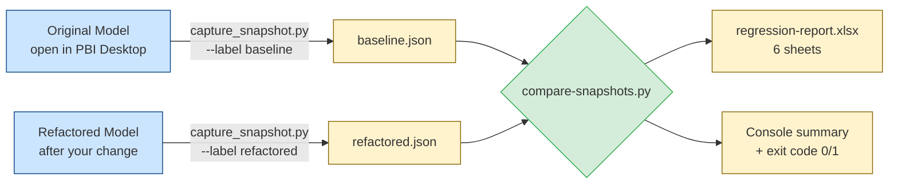
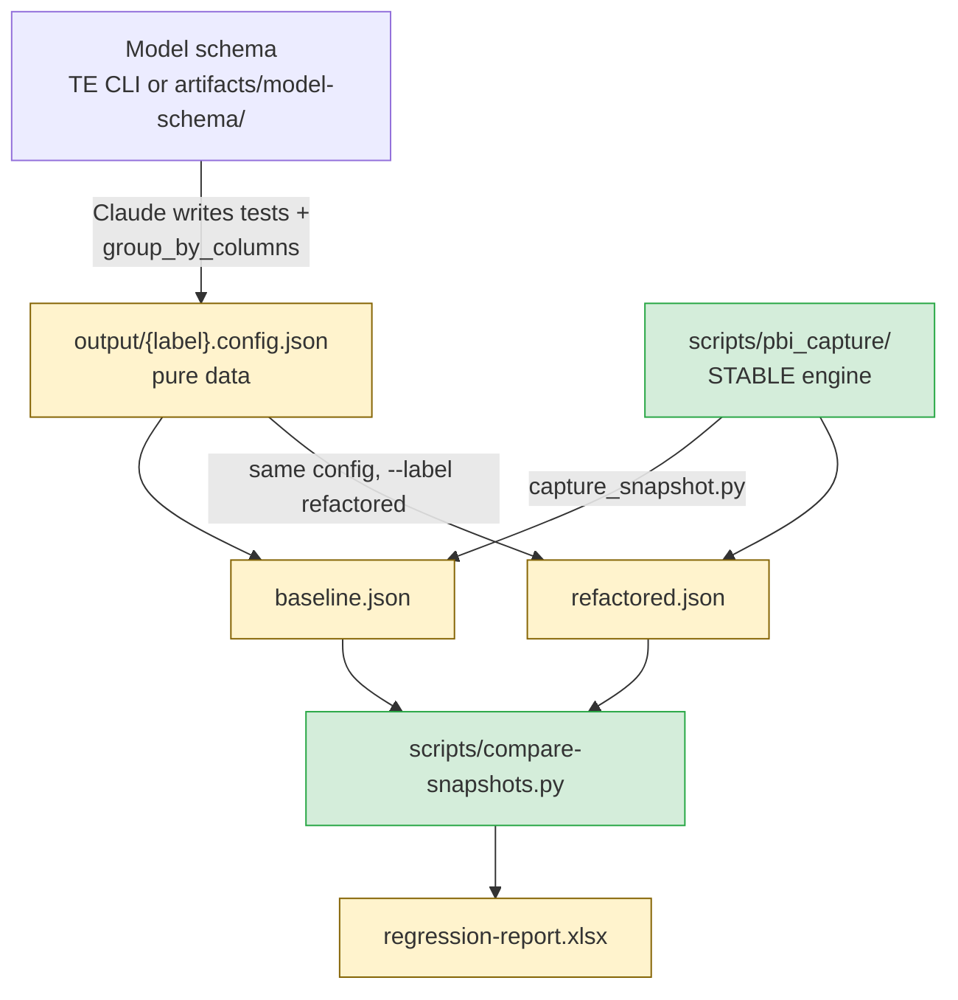
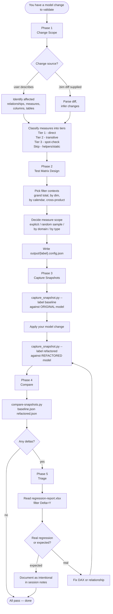

# Regression Testing — Developer Onboarding Guide

> **Audience:** Developers new to this Power BI workflow — no prior Python or Tabular Editor experience assumed.
>
> **Goal:** By the end of this guide, you can run a regression test end-to-end (baseline → change → refactored → compare → report) on any semantic model in the project.

---

## How to Read This Guide

The guide is organized in three concentric layers. Stop at the layer that answers your question.

| Layer | Sections | Best for |
|-------|---------|----------|
| **Layer 1 — Quick Start** | 1 | "I just need to run the test" |
| **Layer 2 — Mental Model + Workflow** | 2–6 | "I need to design a test plan / pick the right options" |
| **Layer 3 — Architecture + Reference** | 7–12 | "Something failed and I need to debug, or I want to understand how this works under the hood" |

1. Quick Start
2. What Is Regression Testing Here?
3. System Architecture
4. The Toolkit
5. The 5-Phase Workflow
6. Running It
7. How the Engine Works
8. First-Day Walkthrough
9. Triage: Reading the Report
10. Glossary
11. Continuous Integration
12. Where to Go Next

---

## 1. Quick Start

You're being asked to verify that a model change (a new relationship, a rewritten DAX measure, a new calculated column, a relationship topology refactor) didn't silently break existing reports. The regression test answers one question: **"Do measures still return the same values they did before the change?"** It also tells you whether queries are now slower, faster, or hanging.

The whole thing runs in Python against a model open in **Power BI Desktop** — no Tabular Editor required.

### The 5-step workflow

1. **Plan** — Decide which measures and which filter contexts to test. Claude builds this with you (Phases 1–2 of the workflow) and writes a JSON config.
2. **Capture baseline** — Run the capture script against the **original** model. Produces `baseline.json`.
3. **Apply your change** — Edit the model (DAX rewrite, relationship change, calc column, etc.).
4. **Capture refactored** — Run the **same script with the same config** against the **modified** model. Produces `refactored.json`.
5. **Compare** — Run the Python comparator. Produces `regression-report.xlsx` — open in Excel, filter for `Delta = Y` to see what broke.

### Files you'll touch

| File | What it is | Where it lives | You edit it? |
|------|-----------|----------------|--------------|
| `output/{label}.config.json` | Your session-specific test config (pure data) | `output/` | **Claude authors it** from your plan; you review it — see §4 |
| `baseline.json`, `refactored.json` | Snapshots of model results | `output/regression/` (override via `OUTPUT_DIR`) | No — auto-generated |
| `scripts/capture_snapshot.py` | The capture runner | `scripts/` | No — stable, ships as-is |
| `scripts/compare-snapshots.py` | Python comparator | `scripts/` | No — generic, ships as-is |
| `regression-report.xlsx` | Final Excel report (6 sheets) | current folder | No — auto-generated |

### Where to next

- **First time?** → §2 (mental model) → §8 (worked example)
- **Need the workflow detail?** → §5
- **How do I actually run it?** → §6
- **Something failed?** → §9
- **Don't know what a term means?** → §10

---

## 2. What Is Regression Testing Here?

### Why test the semantic model, not the reports?

Power BI reports are visualizations on top of measures. A measure that quietly returns wrong values won't always be obvious in a visual — a bar chart will happily render incorrect bars, a card will display a wrong number. Multiple reports use the same measures, so testing the **semantic model layer** validates every report at once. Manual visual testing doesn't scale and misses edge cases.

### The "before vs after" pattern

You capture two snapshots:

- **Baseline** — what the model produces *today*, before your change. This is your ground truth.
- **Refactored** — what the model produces *after* your change.

The comparison is value-by-value. Same query, same filter context, same measure — different results means a regression candidate (or an intentional change you'll mark as expected).

> **Critical:** You must capture baseline **before** applying changes. Once the model is changed, the original baseline is gone forever.

### Model-agnostic engine, model-specific config

This project supports multiple semantic models, each with different tables, measures, and dimensions. But the regression toolchain is the same for all of them:

- **Stable across models:** the capture engine's DAX construction logic, the comparator, the report format.
- **Per-model:** the test case list (which measures × which contexts) and the dimension column references (which `'Table'[Column]` paths are valid in this model).

When a new model is onboarded, you reuse the entire toolchain and only write a new JSON config.

---

## 3. System Architecture

### Data flow



The same capture script runs twice — once against the original model, once against the modified model — driven by **one config file**, with only the `--label` changing. The Python comparator then diffs the two JSON outputs.

### Stable engine + JSON config pattern

This is the central architectural pattern of the toolkit. Understanding it is critical:

- `scripts/pbi_capture/` is a **stable engine package** (config loading, msmdsrv discovery, DAX construction, threaded execution with timeout + memory watchdog, JSON serialization). `scripts/capture_snapshot.py` is the thin CLI in front of it. **You never edit these.**
- Per session, the only artifact is a **JSON config** — `output/{label}.config.json` — which is *pure data*, not code:
  1. `model_name` — written into the JSON snapshot header
  2. `tests` — the list of `{ id, measure, context }` test cases for this session
  3. `group_by_columns` — the context→DAX-column map for this model's dimensions
  4. optional `global_filters` and safety knobs

The engine builds the DAX from this data and executes it. Because the config carries no code, there's nothing to escape, fork, or accidentally break — and the engine doesn't know or care which model you're testing.

### What's reusable vs what's per-model

| Stable across all models (don't touch) | Per-model (write a new config) |
|----------------------------------------|-------------------------------------------|
| DAX query construction logic | `tests` list (`measure × context` cases) |
| Smoke test pre-flight | `group_by_columns` map (DAX column refs) |
| Timeout + memory watchdog | `model_name` |
| JSON output format | optional `global_filters` |
| Comparison tolerance + verdict thresholds | — (`max_rows_per_context` must be 0 for capture) |

---

## 4. The Toolkit

| Tool | Path | Role | You edit it? | Run from |
|------|------|------|--------------|----------|
| **Capture config** | `output/{label}.config.json` | Pure-data test definition (measures, contexts, dimension map) | Claude authors it; you review | n/a — it's data |
| **Capture runner + engine** | `scripts/capture_snapshot.py` + `scripts/pbi_capture/` | Builds DAX, runs it against the connected model under the safety stack, streams results to JSON | Never edit — stable | Any Python 3.10+ terminal (VS Code, PowerShell, CI) |
| **Comparator** | `scripts/compare-snapshots.py` | Diffs two JSON snapshots; emits a 6-sheet Excel report and console summary | Never edit — fully generic | Any Python 3 environment |

### How they fit together



Each session, Claude reads the model schema (via TE CLI or `artifacts/model-schema/`), writes the `tests` and `group_by_columns` into a config, and runs the same stable engine. No script copying, no code injection.

---

## 5. The 5-Phase Workflow



### Per-phase summary

| Phase | What you do | What you produce |
|-------|-------------|------------------|
| **1 — Change Scope** | Describe (or supply a `.bim` diff for) the change. Classify affected measures into Tier 1/2/3/Skip. | Confirmed change list + tier classification |
| **2 — Test Matrix Design** | Pick the dimensions and contexts to test against. Decide whether to test all measures or sample. | `output/{label}.config.json` (test cases + dimension map) |
| **3 — Capture** | Run the capture script twice — once before changes (`--label baseline`), once after (`--label refactored`). | `baseline.json` + `refactored.json` (+ timing CSV + error/timeout logs if any) |
| **4 — Compare** | Run `compare-snapshots.py` on the two JSONs. | `regression-report.xlsx` + console summary + exit code |
| **5 — Triage** | Filter for `Delta = Y` in the Excel report. Decide what's a real regression vs. expected. | Either a green light, or fixes that send you back to Phase 3 |

### Decision points reference

These are the choices you'll face during planning. Defaults work for most cases; deviate when the situation calls for it.

| Decision | Default | When to override |
|----------|---------|------------------|
| **Single-dimension vs cross-product** | Single-dimension for most contexts | Add cross-product (Dim A × Dim B) for Tier 1 measures when the change affects how multiple dimensions filter a fact table or when reports use multi-slicer layouts |
| **Measure scope** | Test all Tier 1 + Tier 2 measures | Random sample (~20 measures stratified by domain) when full set is too large; domain or type filter when investigating a specific area |
| **Row cap (`max_rows_per_context`)** | **0 (all rows) — required.** Regression capture rejects any other value | For a fast smoke pass, use `--diagnostic` (caps the test *count*, not rows). A `TOPN` cap is a benchmark-only knob — it would truncate and destabilize the value comparison |
| **`global_filters`** | Empty (test the full model) | Pin to a year/property when investigating a specific subset or for faster dev iteration |
| **Calc-group testing** | Test base measures only | Test with each calc item (YTD, MTD, PY) when the change touches a calculation group |
| **Cross-product cardinality cap** | Max 3 dimensions | Never combine high-cardinality dimensions (individual name/ID columns) — they explode the test count |

> **Where Claude fits:** Phases 1 and 2 are conversational with Claude — see `.claude/skills/regression-testing/SKILL.md` for the full questioning protocol. Phases 3–5 are mechanical: you run scripts and read the report.

---

## 6. Running It

Capture runs from any Python terminal against a model open in Power BI Desktop. One config drives both captures.

### The commands

```bash
# (optional) dry-run the first few tests to catch config errors early
python scripts/capture_snapshot.py --config output/{model}.config.json --label smoke --diagnostic

# 1. Baseline — Power BI Desktop connected to the ORIGINAL model
python scripts/capture_snapshot.py --config output/{model}.config.json --label baseline

# 2. Apply the change (refactor script / model swap / manual edit), then:
python scripts/capture_snapshot.py --config output/{model}.config.json --label refactored

# 3. Compare
python scripts/compare-snapshots.py output/regression/baseline.json output/regression/refactored.json
```

The engine auto-discovers the local Analysis Services (`msmdsrv`) instance behind Power BI Desktop. If several models are open at once it stops with an actionable list — disambiguate with `--port N` or `--connection-string "<MSOLAP...>"`.

### CLI flags & environment variables

Precedence is **CLI flag > env var > config file > default**, so you never have to edit the config between the two captures.

| Setting | CLI flag | Env var | Default | What it controls |
|---------|----------|---------|---------|------------------|
| Snapshot label | `--label` | `SNAPSHOT_LABEL` | `run` | Output filename label (`baseline` / `refactored`) |
| Model name | — | `MODEL_NAME` | from config | Written to JSON header for the report title |
| Diagnostic mode | `--diagnostic` | `DIAGNOSTIC_MODE` | `false` | Run only the first 8 tests |
| Output dir | — | `OUTPUT_DIR` | `output/regression` | Where snapshots, logs, CSVs land |
| msmdsrv port | `--port` | — | auto | Target a specific instance |
| Connection string | `--connection-string` | `CONNECTION_STRING` | auto | Full MSOLAP string for XMLA endpoints (Fabric, Premium) |
| Query timeout (ms) | — | `QUERY_TIMEOUT_MS` | `60000` | Per-query wall-clock timeout |
| Smoke timeout (ms) | — | `SMOKE_TEST_TIMEOUT_MS` | `10000` | Per-measure pre-flight timeout |
| Memory threshold (%) | — | `MEMORY_THRESHOLD_PCT` | `80` | Memory watchdog trip threshold (% of real RAM) |
| Skip on smoke fail | — | `SKIP_ON_SMOKE_FAILURE` | `true` | Skip measures that fail pre-flight smoke test |

### Legacy: running inside Tabular Editor 3

The original implementation of this workflow was a Tabular Editor 3 C# script. It still ships as `scripts/legacy-tabular-editor/capture-snapshot.csx` for anyone who prefers to run/step through it in the TE3 GUI (press **F5**). Ask Claude to emit it — raw or pre-populated with your `modelName`, `testLines`, and `groupByColumns`. It writes the **same** snapshot schema, so the `compare-snapshots.py` step is identical. This is an opt-in path; the Python runner above is the default and needs no Tabular Editor install.

---

## 7. How the Engine Works

You don't need to *write* any of this. You need just enough vocabulary to know what's happening when something goes wrong. The engine lives in `scripts/pbi_capture/`.

### pythonnet + ADOMD.NET

The engine talks to the model through **ADOMD.NET**, Microsoft's .NET client library for executing DAX against Analysis Services. Python loads that .NET DLL via **pythonnet** (the `clr` module). The DLLs are provisioned once from NuGet into `libs/` by `scripts/pbi_capture/provision_libs.py` — no Tabular Editor or .NET SDK required. (`clr_boot.py` handles discovery and load order.)

### Cancellable execution — `cmd.Cancel()` → `conn.Dispose()`

A DAX query that hangs would otherwise run forever. The executor runs each query on a worker thread while a watchdog polls every 500 ms. On a wall-clock timeout it calls `cmd.Cancel()` (which reliably interrupts storage-engine-bound queries) and, as a backstop, drops the connection with `conn.Dispose()` — which interrupts *any* query, including pure formula-engine materializations that `Cancel()` can't touch. A fresh connection per query makes discarding a timed-out connection free. This is what makes `query_timeout_ms` actually enforceable.

### Memory watchdog (real RAM)

`watchdog.py` reads **actual** total physical RAM via the Windows `GlobalMemoryStatusEx` API and sums the working sets of this Python process plus all `msmdsrv` processes. If usage exceeds `memory_threshold_pct` for 3 consecutive polls (1.5 s sustained), the in-flight query is cancelled. (Because the denominator is real RAM, there's no per-machine scaling to configure.) A single critical reading *between* tests aborts the run (`aborted_memory`).

### `SUMMARIZECOLUMNS` wrapping

For each test case the engine builds a DAX query like:

```dax
EVALUATE
SUMMARIZECOLUMNS(
    'Date'[Year],
    "Result", CALCULATE([Total Sales], KEEPFILTERS('Date'[Year] = 2025))
)
```

You supply the inputs via the config — the measure name (`tests[].measure`), the grouping column(s) (`group_by_columns`), and optional `global_filters` (wrapped as `KEEPFILTERS`). The engine handles the rest: grand-total queries (`SUMMARIZECOLUMNS("Result", …)`, single row) and cross-product queries (multiple group columns from a `|`-separated entry). **Regression capture never adds `TOPN`** — full result sets are compared.

### Smoke-test gating

Before the full run, the engine fires a quick grand-total smoke test for every unique measure:

```dax
EVALUATE ROW("r", [Measure Name])
```

If that fails (syntax error, broken dependency, timeout), the measure is added to a skip list and marked `"status": "skipped"` in every test case for that measure. This keeps a single broken measure from cascading timeouts across the suite. If you see lots of `skipped` rows, check `{label}-timeouts.log` for the smoke failures (tagged `Type: smoketest_*`).

### The config is the only thing you author

> The engine is fixed. Per session, you (via Claude) write only `output/{label}.config.json`:
>
> ```json
> {
>   "workflow": "capture",
>   "model_name": "Sales",
>   "tests": [
>     { "id": "t0001", "measure": "Total Sales", "context": "grand_total" },
>     { "id": "t0002", "measure": "Total Sales", "context": "by_year" }
>   ],
>   "group_by_columns": { "by_year": "'Date'[Year]" }
> }
> ```
>
> Measure names are **bare** — no brackets; the engine adds them. Full key reference: `docs/config-schema.md`.

---

## 8. First-Day Walkthrough

Scenario: you're a new developer on day one. The lead engineer asks you to validate a relationship change — a new direct foreign key is being added between two tables, replacing an older bridge-table path.

### Step 1: Plan the test (5 min, with Claude)

Open Claude in this project and say:
> "I'm validating a refactor — adding a direct FK between [Table A] and [Table B] to replace the existing bridge path. Help me build a regression test."

Claude triggers the `regression-testing` skill, walks you through Phase 1 (change scope, tier classification) and Phase 2 (test contexts, measure selection), and presents a config summary. Confirm the plan.

### Step 2: Write the config (1 min)

Claude reads the model schema, selects the relevant measures and contexts, and writes `output/{model}.config.json`. Review the measure list and contexts before proceeding.

### Step 3: Capture baseline (~5 min)

With the **original** model open in Power BI Desktop:

```bash
python scripts/capture_snapshot.py --config output/{model}.config.json --label baseline
```

Output lands at `output/regression/baseline.json`.

### Step 4: Apply the change

Run the refactor script (or make the change manually, or open the modified model).

### Step 5: Capture refactored (~5 min)

With the **modified** model open:

```bash
python scripts/capture_snapshot.py --config output/{model}.config.json --label refactored
```

### Step 6: Compare (~30 sec)

```bash
python scripts/compare-snapshots.py output/regression/baseline.json output/regression/refactored.json
```

You'll get a console summary like:

```
VALUE COMPARISON
  Pass:        1942 / 1950
  Fail:           4 / 1950
  Row count:      0 / 1950
  Errors:         4 / 1950
  Delta = Y:      8 / 1950

TIMING COMPARISON
  Baseline:      142.3s
  Refactored:     98.5s
  Δ overall:    -30.8%
  Regressions:     3
  Improvements:   28

Report written: regression-report.xlsx
```

### Step 7: Triage

Open `regression-report.xlsx` in Excel:
- Go to the **All Tests** sheet, filter `Delta = Y`
- For each failing row, check the **Value Deltas** sheet for the specific row/column that differs
- BLANK → 0 changes are common when relationship paths change — investigate whether they're expected
- Newly timed-out tests appear in **Timeout Regressions**

If everything is expected (e.g., the BLANK → 0 changes match the refactor's intent), document it. Otherwise, fix the DAX or relationship and loop back to Step 5.

**End-to-end: about 12–15 minutes total** for a typical model.

---

## 9. Triage: Reading the Report

### The 6 sheets of `regression-report.xlsx`

| Sheet | What it shows | When to look here |
|-------|---------------|-------------------|
| **All Tests** | Every test case from baseline + refactored, with `Delta Y/N` flag, baseline/refactored timing, % delta, timing verdict | Start here. Filter `Delta = Y` for failures, sort `Δ ms` desc for performance regressions |
| **Value Deltas** | Only `Delta = Y` rows, expanded to show the specific row key + column + baseline value + refactored value | Drill in to understand exactly what differed |
| **By Measure** | Aggregation by measure: total/avg timing, regression/improvement counts, value delta count | Identify which measures concentrate the failures |
| **By Context** | Same aggregation by context label (`grand_total`, `by_year`, etc.) | Identify which contexts (filter scenarios) are affected |
| **Top Movers** | Top 20 timing regressions + Top 20 timing improvements | Performance triage — what got slower or faster |
| **Timeout Regressions** | Tests that newly timed out in refactored (or were fixed — baseline timed out, refactored didn't) | Hangs and fixes — most critical class of regression |

### Status codes

When a test result has anything other than `status: "ok"`, check the logs:

| Status | Meaning | Where to investigate |
|--------|---------|----------------------|
| `ok` | Query succeeded (still might have value delta) | Compare values in **Value Deltas** sheet |
| `error` | Query threw an exception | `{label}-errors.log` — full DAX + exception |
| `timeout` | Query was cancelled (wall-clock or memory watchdog) | `{label}-timeouts.log` — `Type:` tag distinguishes `query_timeout` vs `memory_watchdog` |
| `skipped` | Measure failed pre-flight smoke test, never ran in main loop | `{label}-timeouts.log` — `Type: smoketest_timeout` or `smoketest_error` |
| `aborted_memory` | Run halted between tests due to sustained memory pressure | `{label}-timeouts.log` and the script's console output for the abort line |

### Common failure patterns

| Pattern | Likely cause |
|---------|--------------|
| **BLANK → 0 (or vice versa)** | New relationship path now produces a match where the old one didn't — could be intentional or a sign of unintended filter propagation |
| **Row count mismatch** | Filter propagation changed; the new path includes/excludes rows differently |
| **Cross-product fails, single-dim passes** | Combined filter interaction issue — usually a relationship direction or cardinality change |
| **Newly timed out** | Refactor broadened a scan (e.g., removed a CROSSFILTER, changed bidir to single dir, introduced ambiguous path) |
| **Numeric difference within tolerance** | Will not flag — the comparator uses `1e-4` tolerance to absorb float arithmetic noise |
| **Many `skipped` measures** | A common dependency (a base measure or relationship) broke the smoke test — fix that one thing and most of the skips will resolve |

### Exit codes (for CI integration)

- `0` — all tests passed (no value deltas, no new errors, no new timeouts)
- `1` — at least one of: value delta, row count mismatch, error in either snapshot, new timeout in refactored
- (The capture runner itself exits `2` only on a fatal setup error — bad config, no/ambiguous instance, CLR load failure.)

---

## 10. Glossary

### Power BI / DAX terms

| Term | Definition | Why it matters here |
|------|-----------|---------------------|
| **SE** | Storage Engine — the columnar data engine that scans the compressed model | Most regression timeouts originate here; the watchdog cancels SE-bound queries |
| **FE** | Formula Engine — evaluates DAX expressions outside the columnar scan | A DAX rewrite that pushes work from SE to FE often shows up as timing changes |
| **ADOMD** | Analysis Services .NET client library for executing DAX | The engine's execution path; loaded into Python via pythonnet |
| **TOM** | Tabular Object Model — .NET API for reading/writing model metadata | Used by `export_schema.py` to serialize a live model; regression capture is read-only DAX (ADOMD), not TOM |
| **pythonnet** | Bridge that lets Python load and call .NET assemblies (`clr`) | How the Python engine uses the ADOMD/TOM DLLs without Tabular Editor |
| **msmdsrv** | The local Analysis Services process Power BI Desktop runs | The engine auto-discovers its port to connect |
| **MSOLAP** | Microsoft OLAP provider — the AS connection string protocol | `--connection-string` / `CONNECTION_STRING` expects this format for XMLA endpoints |
| **XMLA** | XML for Analysis — protocol for a remote semantic model (Fabric, Premium, SSAS) | Set a connection string with an XMLA endpoint to capture from a published model |
| **PBIP** | Power BI Project — folder-based project format (model + report as text) | Power BI Desktop on a `.pbip` exposes a local AS instance the engine connects to |
| **BLANK** | DAX's null/empty value — semantically distinct from `0` | The comparator treats `BLANK → 0` as a real delta; relationship changes often surface here |
| **bidir** | Bidirectional relationship — filters propagate in both directions | Removing bidir changes filter propagation; many regressions stem from this |
| **FK** | Foreign key — the column linking a fact table to a dimension | New/changed FKs are a common change scope |
| **calc column** | Calculated column — DAX-evaluated column materialized at refresh | Different from a measure; test downstream measures that use it |
| **calc group** | Calculation group — applies transformations (YTD, MTD, PY…) based on a selected item | Test by adding the calc group column as a filter context |
| **RLS** | Row-level security — identity-based row filtering | Regression tests run under one role at a time |
| **`SUMMARIZECOLUMNS`** | DAX function that groups by columns and evaluates measures per group | Core pattern in the engine's DAX construction |
| **`KEEPFILTERS`** | Modifier that intersects a filter with existing filter context | How `global_filters` are applied around each measure |
| **`TREATAS`** | Injects a virtual filter from a value list onto a column | Used by the *benchmark* path for slicer simulation; capture uses `KEEPFILTERS` boolean filters |
| **`TOPN`** | DAX function returning the top N rows of a table | A benchmark row cap; **rejected** by regression capture (it truncates/destabilizes value comparison) |

### Regression workflow terms

| Term | Definition |
|------|-----------|
| **baseline** | Snapshot captured from the **original** model, before changes — your ground truth |
| **refactored** | Snapshot captured from the **modified** model, after changes |
| **test case** | One `(measure, context)` pairing; produces one or more rows of comparison data |
| **tier** | Measure criticality: Tier 1 (directly affected), Tier 2 (transitively affected), Tier 3 (unaffected, spot-check), Skip (helpers, static, `_`-prefixed) |
| **context** | A filter/grouping scenario (`grand_total`, `by_year`, `by_dim1_x_year`, etc.) |
| **config** | `output/{label}.config.json` — the pure-data test definition produced in Phase 2 |
| **smoke test** | Pre-flight `EVALUATE ROW("r", [Measure])` per measure — gates the main run |
| **delta** | A test case where baseline values differ from refactored values; flagged `Delta = Y` |
| **tolerance** | Numeric precision threshold for value comparison (`1e-4` by default) — absorbs float noise |
| **global filter** | DAX boolean filter applied to every measure evaluation via `KEEPFILTERS` |
| **diagnostic mode** | `--diagnostic` — runs only the first ~8 tests, for verifying the config is wired correctly before a full run |

---

## 11. Continuous Integration

Two distinct levels of CI apply to this project:

### Repo CI (shipped)

The repository runs a GitHub Actions workflow (`.github/workflows/ci.yml`) on every push/PR: it installs the Python deps and runs the fast unit suite (`pytest -m "not live"`) on a Windows runner. That suite covers the engine's pure logic (config validation, DAX construction, serialization, discovery, watchdog) **without** needing Power BI Desktop. The green "tests passing" badge on the README reflects this.

### Model-level regression CI (capability, not yet a committed pipeline)

Running an *actual* regression capture needs a live Analysis Services instance, so it can't run on a stock cloud runner — it's excluded from repo CI (the `live` pytest marker). The pieces for a self-hosted pipeline are in place, though:

- **Flag/env-driven configuration** — every knob has a CLI flag or env var (see §6)
- **Exit codes** — `compare-snapshots.py` returns `0` on pass, `1` on any failure
- **Streaming JSON output** — a force-killed run still has partial results and a `{label}-testplan.json` showing the in-flight test
- **Bounded runtime** — the memory watchdog and query timeout cancel runaway queries

What's not yet committed: the runner host (a self-hosted agent with Power BI Desktop / an XMLA endpoint), the model source-of-truth path, and artifact storage.

```bash
#!/bin/bash
# Notional self-hosted pipeline — illustrative, not a committed convention.
set -e
export OUTPUT_DIR=/tmp/regression-$BUILD_ID

# 1. Baseline from main/production (model open via PBIP or XMLA endpoint)
python scripts/capture_snapshot.py --config ./output/{model}.config.json --label baseline

# 2. Refactored from the PR branch's model
python scripts/capture_snapshot.py --config ./output/{model}.config.json --label refactored

# 3. Compare — exit code propagates to CI status (1 blocks the PR)
python scripts/compare-snapshots.py \
    $OUTPUT_DIR/baseline.json $OUTPUT_DIR/refactored.json \
    --output $OUTPUT_DIR/regression-report.xlsx
```

For XMLA deployment / model-fetch automation, the **`tabular-editor:te2-cli`** and **`fabric-cli:fabric-cli`** data-goblin plugin skills are the source of truth.

---

## 12. Where to Go Next

Now that you've completed onboarding, these are the canonical references for deeper detail. Bookmark them.

| Source | What's there | When to consult |
|--------|--------------|-----------------|
| `.claude/skills/regression-testing/SKILL.md` | Full Claude-facing procedural guide — Phases 1 and 2 in conversational detail | When designing a complex test plan |
| `docs/config-schema.md` | Every capture/benchmark config key, with types and rules | When writing or debugging a config by hand |
| `.claude/skills/regression-testing/references/overview.md` | Capture parameter notes | When tuning `global_filters` or safety limits |
| `scripts/pbi_capture/config.py` | The authoritative config schema + validation | When you hit a validation error and want the exact rule |
| `scripts/compare-snapshots.py` (top constants) | Numeric tolerance, regression/improvement %, MS thresholds | When tuning what counts as a "real" timing regression |
| `CLAUDE.md` (project root) | Project conventions, working style, file routing | Onboarding to the whole project |
| `knowledge/knowledge-index.md` | Routing manifest for project KB | When you don't know which knowledge file to read |

### Plugin skills (data-goblin `power-bi-agentic-development`)

These ship with the installed plugin and own deeper domains. Trigger them by asking Claude about the relevant topic.

| Skill | Domain |
|-------|--------|
| `semantic-models:dax` | DAX optimization, performance tuning, anti-patterns |
| `tabular-editor:c-sharp-scripting` | Writing C# scripts for TOM (model mutation) |
| `pbi-desktop:connect-pbid` | Live TOM / DAX queries against Power BI Desktop |
| `pbip:tmdl` | TMDL editing, BIM-to-TMDL migration |
| `tabular-editor:te2-cli` | TE2 CLI flags, deployment automation |
| `fabric-cli:fabric-cli` | Fabric workspace operations, deployment to service |

---

*Maintained alongside `.claude/skills/regression-testing/SKILL.md` — when the workflow changes meaningfully, update both. This guide intentionally summarizes; SKILL.md remains the procedural source of truth.*
